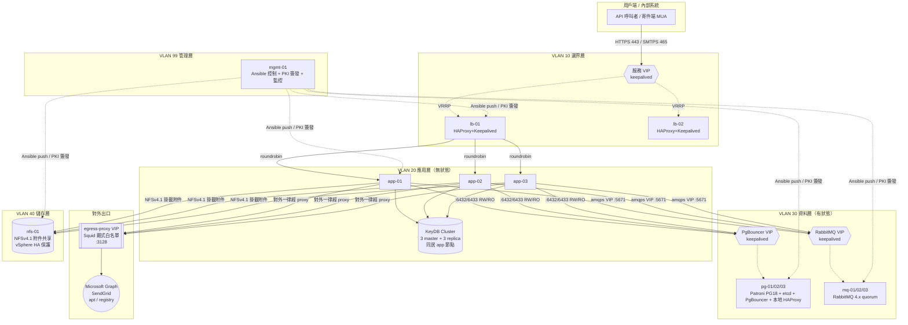
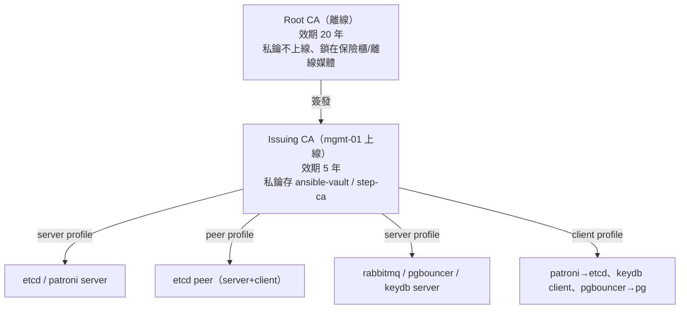
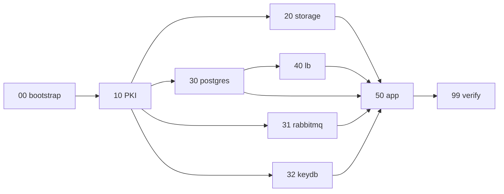

# email_proxy 正式環境重建：地端基礎設施最佳實踐規劃書

> Greenfield（全新平行重建）／VMware 起手／獨立 NFS／GitOps 化 Ansible
> 目標：一次歸零上一份稽核（[MIS_INFRASTRUCTURE_GUIDE.md](MIS_INFRASTRUCTURE_GUIDE.md) §10）發現的所有落差，並建立可長期維運的標準架構。

---

## 0. 這份文件的定位與前提

- **定位**：這是「目標藍圖 + 可直接執行的 Ansible」，不是現況描述。命名、IP、憑證體系全部重新設計，與現有 `-4/5/6` 環境**平行並存**，切換完成前舊環境保留為 fallback。
- **設計原則**（本文所有決策都回推到這四條）：
  1. **故障域隔離**：任一實體 ESXi 主機、任一 VM 故障，都不得讓任何一個 quorum 型叢集（etcd / Patroni / RabbitMQ / KeyDB）失去多數。
  2. **狀態與無狀態分離**：LB、App 是無狀態、可隨時重建；資料層（PG / MQ / KeyDB / NFS）是有狀態、需備份與 HA。
  3. **單一信任根**：全站一套 PKI，不再每個服務各自簽一個 CA。
  4. **IaC 為唯一事實來源**：所有設定由 Git 上的 Ansible 產生，禁止手改機器（消除 config drift）。
- **本文與前一份文件的分工**：完整的 service config 內容（`patroni.yml`、`rabbitmq.conf`、`pgbouncer.ini` 等 body）已在 [MIS_INFRASTRUCTURE_GUIDE.md](MIS_INFRASTRUCTURE_GUIDE.md) 中逐字保留；**本文聚焦在「資源規劃、網段、PKI、Ansible 目錄結構與最佳實踐 delta」**，config body 只列出與現況不同、需要改的部分，其餘引用前文。

---

## 1. 目標架構總覽



---

## 2. VMware 資源切割（從 vSphere 開始）

### 2.1 ESXi 實體主機與故障域

- **最低要求 3 台 ESXi 實體主機**（若只有 2 台，任一台故障時所有三節點叢集只剩 1 節點 = 失去 quorum，HA 形同虛設）。
- 啟用 **vSphere HA** + **DRS**，並為每個三節點叢集建立 **anti-affinity（VM-VM 反親和）規則**：同一叢集的三個成員永遠分散在三台不同 ESXi，任一台實體故障最多只影響每個叢集的 1 個節點。

| 反親和群組 | 成員 | 規則 | 理由 |
|---|---|---|---|
| `AA-postgres` | pg-01/02/03 | 必須分散 3 台 ESXi | Patroni + etcd quorum，掉 2 個才失去多數 |
| `AA-rabbitmq` | mq-01/02/03 | 必須分散 3 台 ESXi | RabbitMQ quorum queue 靠 Raft 多數 |
| `AA-app` | app-01/02/03 | 必須分散 3 台 ESXi | 同居的 KeyDB cluster 也要分散 |
| `AA-lb` | lb-01/02 | 必須分散 2 台 ESXi | VIP 主備不可同機 |

> ESXi 對 etcd / PG WAL 這類 **fsync 敏感**的工作負載，datastore 底層建議走 SSD/NVMe，並關閉會延後寫入確認的快取策略；etcd 的 `fdatasync` 延遲直接決定 Patroni 的穩定度。

### 2.2 VM 清單與資源配額（合計 13 台）

| # | VM 名稱 | 角色 | vCPU | RAM | OS 碟 | 資料碟 | 所在 VLAN |
|---|---|---|---|---|---|---|---|
| 1 | `lb-01` | HAProxy + Keepalived | 2 | 4 GB | 40 GB | — | 10 邊界 |
| 2 | `lb-02` | HAProxy + Keepalived | 2 | 4 GB | 40 GB | — | 10 邊界 |
| 3 | `app-01` | api + worker + smtp-receiver + KeyDB | 4 | 8 GB | 60 GB | — | 20 應用 |
| 4 | `app-02` | 同上 | 4 | 8 GB | 60 GB | — | 20 應用 |
| 5 | `app-03` | 同上 | 4 | 8 GB | 60 GB | — | 20 應用 |
| 6 | `pg-01` | Patroni/PG18 + etcd + PgBouncer + HAProxy | 6 | 16 GB | 40 GB | 200 GB SSD（data）+ 50 GB（WAL）+ 10 GB（etcd） | 30 資料 |
| 7 | `pg-02` | 同上 | 6 | 16 GB | 40 GB | 同上 | 30 資料 |
| 8 | `pg-03` | 同上 | 6 | 16 GB | 40 GB | 同上 | 30 資料 |
| 9 | `mq-01` | RabbitMQ 4.x | 4 | 8 GB | 40 GB | 100 GB | 30 資料 |
| 10 | `mq-02` | 同上 | 4 | 8 GB | 40 GB | 100 GB | 30 資料 |
| 11 | `mq-03` | 同上 | 4 | 8 GB | 40 GB | 100 GB | 30 資料 |
| 12 | `nfs-01` | NFSv4.1 附件共享 | 2 | 8 GB | 40 GB | 500 GB–1 TB（附件） | 40 儲存 |
| 13 | `mgmt-01` | Ansible 控制 + PKI 簽發 + Prometheus/Grafana | 4 | 8 GB | 100 GB | 200 GB（監控 TSDB） | 99 管理 |

**合計約 52 vCPU / 120 GB RAM / ~2.5 TB 儲存**（未計 thin provisioning 節省）。

### 2.3 磁碟與控制器最佳實踐

- PG 的 **data / WAL / etcd 各用獨立 VMDK**，掛在**獨立的 PVSCSI 控制器**上，避免 WAL 寫入與資料查詢互相搶 IO。
- 有狀態資料碟（PG、MQ、NFS）設 **`Independent - Persistent`**，並排除在 VM 層級快照之外（改用資料庫原生備份，見 §9）。
- KeyDB 是純快取（14 天 TTL），用 OS 碟即可,不另切資料碟。

### 2.4 為何 KeyDB 同居 app 而不獨立成 VM

email_proxy 的 KeyDB 只存 OAuth token 快取與寄送狀態,負載極輕、且 app 本來就對本機 KeyDB 連線最快。同居可省 3 台 VM。**但必為 3 master + 3 replica**（見 §7）以修正現況「3 master 無副本、掉一台就有 1/3 slot 不可用」的問題。若日後 KeyDB 用途擴大,再水平切出獨立 3 節點即可,對 app 連線字串無影響。

---

## 3. 內網網段規劃

以 `10.20.0.0/16` 為例（請替換成貴司實際配發網段）。**依故障域與信任邊界切 VLAN**，而非把所有機器塞在一個大平面網段（現況 `10.2.6.x` 混雜了 PG 與 MQ）。

| VLAN | 網段 | 用途 | 對外可達性 |
|---|---|---|---|
| 10 邊界 | `10.20.10.0/24` | 服務 VIP + lb-01/02 | 用戶端可達 443/465 |
| 20 應用 | `10.20.20.0/24` | app-01/02/03 + KeyDB | 僅 LB → App、App → 資料層 |
| 30 資料 | `10.20.30.0/24` | pg / mq VIP 與節點 | 僅 App、mgmt 可達 |
| 40 儲存 | `10.20.40.0/24` | nfs-01 | 僅 App、mgmt 可達 |
| 99 管理 | `10.20.99.0/24` | mgmt-01、iLO/IPMI、SSH、VRRP heartbeat | 僅維運跳板可達 |

**位址配置範例**

```
# 服務 VIP（keepalived 浮動）
10.20.10.10   svc-api.ptc-nec.com.tw        # HTTPS / SMTPS 對外入口
# 邊界
10.20.10.11   lb-01
10.20.10.12   lb-02
# 應用
10.20.20.11-13 app-01 / app-02 / app-03
# 資料 — PostgreSQL
10.20.30.10   pgbouncer-vip.ptc-nec.com.tw  # app 連這個（取代舊的 postgresql-b）
10.20.30.11-13 pg-01 / pg-02 / pg-03
# 資料 — RabbitMQ
10.20.30.20   rabbitmq-vip.ptc-nec.com.tw   # app 連這個
10.20.30.21-23 mq-01 / mq-02 / mq-03
# 儲存
10.20.40.11   nfs-01
# 管理
10.20.99.11   mgmt-01
```

**防火牆（東西向）最小開放原則**：用 VLAN ACL 或主機 nftables 限制到「只開必要的 port」。關鍵規則：

| 來源 | 目的 | Port | 說明 |
|---|---|---|---|
| 用戶端 | 服務 VIP | 443, 465 | 唯一對外入口 |
| lb | app | 8080, 2525 | HTTPS/SMTP 後端 |
| app | pgbouncer-vip | 6432, 6433 | RW/RO |
| app | rabbitmq-vip | 5671 | AMQPS（**經 VIP，不再直連 25671**，修正 §10.4） |
| app | nfs-01 | 2049 | NFSv4.1（單一 port，不需 rpcbind/portmap） |
| app | 各 app 節點自己 | 6379/16379 | KeyDB cluster 匯流排 |
| pg 節點互連 | pg 節點 | 5432, 8008, 2379/2380 | Patroni + etcd |
| mq 節點互連 | mq 節點 | 5672(內), 25672, 4369 | Erlang 叢集 |
| app | egress-proxy | 3128 | 唯一對外出口 |
| mgmt | 全部 | 22 | Ansible / 維運 |

---

## 4. 對外 Proxy（egress）設計

保留現有「所有對外流量集中經正向代理」的模型（實測是 Squid,見前文 §9.2），但強化為**顯式白名單出口**:

- **egress-proxy 用主備兩節點 + VIP**，避免單台 Squid 成為全站對外 SPOF（現況 `proxy.ptc-nec.com.tw` 是單一 IP，一旦掛掉,寄信與 token 更新全斷）。
- **顯式網域白名單**（Squid `dstdomain` ACL），只放行 email_proxy 真正需要的對外目的地,其餘一律拒絕:

```
# /etc/squid/allowlist.txt（由 Ansible 管理）
.login.microsoftonline.com
.graph.microsoft.com
.sendgrid.net
api.sendgrid.com
.docker.io
.docker.com
.ubuntu.com
.githubusercontent.com   # RabbitMQ delayed-message plugin 下載用
```

- App 端環境變數維持三件套,`NO_PROXY` 補齊所有內網 VIP 與網段,確保內部連線一律直連、不進 proxy 也不被記錄:

```bash
HTTP_PROXY=http://egress-proxy.ptc-nec.com.tw:3128
HTTPS_PROXY=http://egress-proxy.ptc-nec.com.tw:3128
NO_PROXY=localhost,127.0.0.1,.ptc-nec.com.tw,10.20.0.0/16
```

> 用 `.ptc-nec.com.tw` + 內網 CIDR 一次涵蓋所有內部服務,避免現況那種「逐台列 host」漏列的風險。

---

## 5. PKI / CA 憑證體系（重點重構）

### 5.1 現況問題

現有做法是**每個 playbook 各自 `openssl` 生一個獨立 CA**（etcd 一個、pg 一個、pgbouncer 一個、rabbitmq 一個、keydb 一個），且憑證效期 **36500 天（100 年）**。缺點：信任根碎片化、無法跨服務互信、100 年效期等於放棄輪替、私鑰散落各 playbook 目錄。

### 5.2 目標：單一信任根的兩層 PKI



**規則**：

- 全站**共用一個 Root → 一個 Issuing CA**，所有服務葉憑證都由同一個 Issuing CA 簽,任何服務只要信任這一條鏈就能驗證彼此。
- **葉憑證效期 397 天**（相容瀏覽器/現代 TLS 上限）,由 `10-pki.yml` 每季重簽,並在監控加「憑證到期前 30 天告警」。
- **憑證 profile 分離**：`server`（serverAuth）、`client`（clientAuth）、`peer`（both，etcd 用）。
- **SAN 一定含 FQDN + 短名 + IP**（沿用現有 playbook 的好做法,現有 openssl.cnf 已做對這件事）。
- 私鑰保護：Root CA 私鑰**離線保存、絕不進 Ansible/Git**;Issuing CA 私鑰用 `ansible-vault` 加密存放。**進階選項（建議中長期採用）**:在 mgmt-01 跑 **Smallstep `step-ca`** 或 **HashiCorp Vault PKI engine**,提供 ACME 自動簽發 + 短效憑證 + 自動輪替,徹底免手動 openssl。本文的 `internal_ca` / `pki_leaf` role 提供 openssl 版基準（貼近現有工具鏈,可先落地）,並在 role 內預留切換 step-ca 的介面。

---

## 6. Ansible 專案：GitOps 化目錄結構

### 6.1 目錄樹

```
ansible-email-proxy/                      # 獨立 Git repo
├── ansible.cfg
├── requirements.yml                      # collection 依賴（community.docker 等）
├── README.md
├── .gitignore                            # 排除 *.retry、明文 vault key
├── inventories/
│   └── prod/
│       ├── hosts.yml                     # 唯一事實來源的主機清單（YAML 格式）
│       ├── group_vars/
│       │   ├── all/
│       │   │   ├── vars.yml              # 全站共用非機密變數
│       │   │   └── vault.yml             # ★ ansible-vault 加密（密碼/金鑰）
│       │   ├── lb.yml
│       │   ├── app.yml
│       │   ├── postgres.yml
│       │   ├── rabbitmq.yml
│       │   ├── keydb.yml
│       │   ├── nfs.yml
│       │   └── monitoring.yml
│       └── host_vars/
│           ├── pg-01.yml                 # 每台獨有（如 keepalived priority）
│           └── ...
├── playbooks/
│   ├── site.yml                          # 總入口，import 下列各階段
│   ├── 00-bootstrap.yml                  # 系統基線（時區/NTP/sysctl/limits/docker/proxy）
│   ├── 10-pki.yml                        # 建 Root+Issuing CA、簽發並派送葉憑證
│   ├── 20-storage.yml                    # nfs-01 export + app 節點掛載
│   ├── 30-postgres.yml                   # etcd → patroni/pg18 → pgbouncer → 本地 haproxy
│   ├── 31-rabbitmq.yml                   # rabbitmq cluster + quorum queue
│   ├── 32-keydb.yml                      # keydb 3 master + 3 replica
│   ├── 40-lb.yml                         # 邊界 haproxy + keepalived
│   ├── 50-app.yml                        # api/worker/smtp compose 佈署
│   ├── 60-monitoring.yml                 # prometheus/grafana/exporters
│   └── 99-verify.yml                     # 全鏈健康檢查（取代散落的 check_*.sh）
├── roles/
│   ├── common/                           # 所有主機共用基線
│   ├── docker/
│   ├── internal_ca/                      # 只在 mgmt-01 跑，建 Root+Issuing CA
│   ├── pki_leaf/                         # 各主機領葉憑證
│   ├── nfs_server/  ├── nfs_client/
│   ├── etcd/  ├── patroni/  ├── pgbouncer/
│   ├── rabbitmq/  ├── keydb/
│   ├── haproxy/  ├── keepalived/
│   ├── app_stack/                        # api/worker/smtp 的 compose
│   └── monitoring/
└── collections/                          # requirements.yml 安裝到這（可 commit 或 CI 還原）
```

**核心最佳實踐 delta（相對現況）**：

| 現況問題（前文 §10） | 本設計的解法 |
|---|---|
| playbook 與實環境脫節、改過的版本沒存回 | 唯一 Git repo，禁止手改機器；改設定 = 改 role/vars → PR → 重跑 |
| inventory 舊世代 `-1/2/3` 與實跑 `-4/5/6` 不符 | `inventories/prod/hosts.yml` 為唯一事實來源，改機器先改這裡 |
| 每次 `--ask-pass` 人工輸密碼、無版控 | 每台專用 SSH key（免密）+ sudoers NOPASSWD 限定；機密走 `ansible-vault` |
| 每服務各自一個 CA、100 年效期 | 單一 `internal_ca` role + `pki_leaf` role，397 天可輪替 |
| 三節點 haproxy.cfg 不同步 | 同一份 `haproxy` role + 模板，`serial` 滾動套用,不可能各機不同 |
| 附件寫本機碟 | `nfs_client` role 統一掛載,`app_stack` 的 `ATTACHMENT_VOLUME_PATH` 指向 NFS 掛載點 |
| `housekeeping.yaml`（MySQL）等無關檔混入 | repo 只放 email_proxy 相關 role,無關專案不進來 |

### 6.2 `ansible.cfg`

```ini
[defaults]
inventory = inventories/prod/hosts.yml
roles_path = roles
collections_path = collections
host_key_checking = True
retry_files_enabled = False
forks = 10
vault_password_file = ~/.ansible/vault_pass        # 或改用 --vault-id 走外部 KMS
stdout_callback = yaml
callbacks_enabled = profile_tasks

[privilege_escalation]
become = True
become_method = sudo
become_ask_pass = False                            # 靠 sudoers NOPASSWD，不再人工輸入

[ssh_connection]
pipelining = True
ssh_args = -o ControlMaster=auto -o ControlPersist=60s
```

### 6.3 `requirements.yml`

```yaml
---
collections:
  - name: community.docker
    version: ">=3.10.0"
  - name: community.crypto        # 取代裸 openssl shell，做 PKI
    version: ">=2.20.0"
  - name: ansible.posix           # mount / sysctl / firewalld
    version: ">=1.5.0"
  - name: community.general
```

### 6.4 `inventories/prod/hosts.yml`

```yaml
---
all:
  vars:
    ansible_user: ansible                          # 專用帳號，非 ptcadmin
    ansible_ssh_private_key_file: ~/.ssh/id_email_proxy
    domain: ptc-nec.com.tw
    egress_proxy_url: "http://egress-proxy.ptc-nec.com.tw:3128"
  children:

    lb:
      hosts:
        lb-01: { ansible_host: 10.20.10.11, keepalived_priority: 150, keepalived_state: MASTER }
        lb-02: { ansible_host: 10.20.10.12, keepalived_priority: 100, keepalived_state: BACKUP }
      vars:
        service_vip: 10.20.10.10

    app:
      hosts:
        app-01: { ansible_host: 10.20.20.11 }
        app-02: { ansible_host: 10.20.20.12 }
        app-03: { ansible_host: 10.20.20.13 }

    keydb:                                          # 與 app 同主機（見 §7）
      hosts:
        app-01: {}
        app-02: {}
        app-03: {}

    postgres:
      hosts:
        pg-01: { ansible_host: 10.20.30.11, patroni_priority: high }
        pg-02: { ansible_host: 10.20.30.12, patroni_priority: mid }
        pg-03: { ansible_host: 10.20.30.13, patroni_priority: low }
      vars:
        pgbouncer_vip: 10.20.30.10
        pg_cluster_scope: email-proxy-pg
        pg_version: "18"

    etcd:                                           # 與 postgres 同主機
      hosts:
        pg-01: {}
        pg-02: {}
        pg-03: {}

    rabbitmq:
      hosts:
        mq-01: { ansible_host: 10.20.30.21, rabbitmq_master: true }
        mq-02: { ansible_host: 10.20.30.22 }
        mq-03: { ansible_host: 10.20.30.23 }
      vars:
        rabbitmq_vip: 10.20.30.20

    nfs:
      hosts:
        nfs-01: { ansible_host: 10.20.40.11 }

    monitoring:
      hosts:
        mgmt-01: { ansible_host: 10.20.99.11 }
```

### 6.5 機密管理：`group_vars/all/vault.yml`（ansible-vault 加密）

```yaml
# 用 `ansible-vault edit inventories/prod/group_vars/all/vault.yml` 編輯
# 檔案在 Git 內是密文，只有持 vault key 者可解
vault_postgres_superuser_password: "<在此填真值，vault 加密>"
vault_postgres_replicator_password: "..."
vault_pgbouncer_auth_password: "..."
vault_pgbouncer_admin_password: "..."
vault_pgbouncer_server_password: "..."
vault_rabbitmq_admin_password: "..."
vault_rabbitmq_erlang_cookie: "..."
vault_rabbitmq_app_user_password: "..."
vault_keydb_password: "..."
vault_app_jwt_secret: "..."
vault_app_encryption_key: "..."
vault_microsoft_client_secret: "..."
vault_sendgrid_api_key: "..."
```

`group_vars/all/vars.yml` 則只放非機密,並以 `!vault`/變數引用串接:

```yaml
postgres_superuser_password: "{{ vault_postgres_superuser_password }}"
rabbitmq_admin_password: "{{ vault_rabbitmq_admin_password }}"
# 各 role 一律引用這些「已解密的別名」，role 內不直接碰 vault_*
```

> **重點**：修正現況「PG/PgBouncer/SSH 共用同一組弱密碼」的問題——vault 內每個服務用**獨立強密碼**,並排定輪替。

---

## 7. 各服務的最佳實踐 delta 與代表性 role

以下只列「與現況不同、需要改」的部分與代表性 role 骨架；完整 config body 引用 [MIS_INFRASTRUCTURE_GUIDE.md](MIS_INFRASTRUCTURE_GUIDE.md)。

### 7.1 `common` role（系統基線）

沿用現有 `0_bootstrap.yml` 的內容（時區、chrony NTP、sysctl、nofile/nproc limits、關 swap），改寫成 role。代表性 `roles/common/tasks/main.yml`：

```yaml
---
- name: 設定時區
  community.general.timezone: { name: "{{ timezone | default('Asia/Taipei') }}" }

- name: 安裝基線套件
  ansible.builtin.apt:
    name: [chrony, auditd, sysstat, socat, curl, nfs-common, unzip]
    state: present
    update_cache: true

- name: 佈署 chrony 設定
  ansible.builtin.template:
    src: chrony.conf.j2
    dest: /etc/chrony/chrony.conf
  notify: restart chrony

- name: 套用 sysctl 調校
  ansible.posix.sysctl:
    name: "{{ item.key }}"
    value: "{{ item.value }}"
    sysctl_set: true
    reload: true
  loop: "{{ sysctl_tuning | dict2items }}"

- name: 關閉 swap（runtime + fstab）
  block:
    - ansible.builtin.command: swapoff -a
      changed_when: false
    - ansible.builtin.replace:
        path: /etc/fstab
        regexp: '^(?!#)(.*\sswap\s.*)$'
        replace: '# \1'

- name: 設定系統級 limits
  ansible.builtin.copy:
    dest: /etc/security/limits.d/99-email-proxy.conf
    content: |
      * soft nofile {{ nofile_limit | default(1048576) }}
      * hard nofile {{ nofile_limit | default(1048576) }}
```

### 7.2 `internal_ca` role（只在 mgmt-01 跑一次）

用 `community.crypto` 取代裸 openssl,可讀性與冪等性都更好。代表片段：

```yaml
---
- name: 建立 CA 目錄
  ansible.builtin.file: { path: "{{ ca_root }}", state: directory, mode: "0700" }

# ---- Root CA（離線概念：建好後私鑰應搬離線；此處示範建立流程）----
- name: 產生 Root CA 私鑰
  community.crypto.openssl_privatekey:
    path: "{{ ca_root }}/root-ca.key"
    size: 4096
    mode: "0600"

- name: 產生 Root CA 自簽憑證（20 年）
  community.crypto.x509_certificate:
    path: "{{ ca_root }}/root-ca.crt"
    privatekey_path: "{{ ca_root }}/root-ca.key"
    provider: selfsigned
    selfsigned_not_after: "+7300d"
    selfsigned_create_subject_key_identifier: true

# ---- Issuing CA（上線簽發，效期 5 年，由 Root 簽）----
- name: 產生 Issuing CA 私鑰
  community.crypto.openssl_privatekey:
    path: "{{ ca_root }}/issuing-ca.key"
    size: 4096
    mode: "0600"

- name: Issuing CA CSR
  community.crypto.openssl_csr:
    path: "{{ ca_root }}/issuing-ca.csr"
    privatekey_path: "{{ ca_root }}/issuing-ca.key"
    common_name: "email-proxy Issuing CA"
    basic_constraints: ["CA:TRUE", "pathlen:0"]
    basic_constraints_critical: true
    key_usage: ["keyCertSign", "cRLSign"]

- name: Root 簽發 Issuing CA（5 年）
  community.crypto.x509_certificate:
    path: "{{ ca_root }}/issuing-ca.crt"
    csr_path: "{{ ca_root }}/issuing-ca.csr"
    ownca_path: "{{ ca_root }}/root-ca.crt"
    ownca_privatekey_path: "{{ ca_root }}/root-ca.key"
    provider: ownca
    ownca_not_after: "+1825d"

- name: 組出 CA chain（供各服務信任）
  ansible.builtin.assemble:
    src: "{{ ca_root }}"
    regexp: '(issuing-ca|root-ca)\.crt$'
    dest: "{{ ca_root }}/ca-chain.crt"
```

### 7.3 `pki_leaf` role（各主機領葉憑證，397 天）

```yaml
---
- name: 產生本機私鑰
  community.crypto.openssl_privatekey:
    path: "{{ pki_dir }}/{{ inventory_hostname }}.key"
    size: 2048
    mode: "0640"

- name: 產生 CSR（含 SAN：FQDN + 短名 + IP）
  community.crypto.openssl_csr:
    path: "{{ pki_dir }}/{{ inventory_hostname }}.csr"
    privatekey_path: "{{ pki_dir }}/{{ inventory_hostname }}.key"
    common_name: "{{ inventory_hostname }}.{{ domain }}"
    subject_alt_name: >-
      {{ ['DNS:' + inventory_hostname + '.' + domain,
          'DNS:' + inventory_hostname,
          'IP:' + ansible_host] }}
    key_usage: ["digitalSignature", "keyEncipherment"]
    extended_key_usage: "{{ pki_eku | default(['serverAuth']) }}"   # server/client/both 由呼叫端帶入

- name: 送 CSR 到 mgmt-01 由 Issuing CA 簽發（397 天）
  delegate_to: mgmt-01
  community.crypto.x509_certificate:
    path: "{{ pki_dir }}/{{ inventory_hostname }}.crt"
    csr_content: "{{ lookup('file', pki_dir + '/' + inventory_hostname + '.csr') }}"
    ownca_path: "{{ ca_root }}/issuing-ca.crt"
    ownca_privatekey_path: "{{ ca_root }}/issuing-ca.key"
    provider: ownca
    ownca_not_after: "+397d"

- name: 派送 CA chain 給本機信任
  ansible.builtin.copy:
    src: "{{ ca_root }}/ca-chain.crt"
    dest: "{{ pki_dir }}/ca.crt"
```

### 7.4 `nfs_server` / `nfs_client`（修正附件本機化，§10.1/§10.7）

**這是修正現況最大痛點的核心。** 附件從「各節點本機碟」改為「全 app 節點掛同一個 NFS」,徹底解決「SMTP 收信節點與 worker 寄送節點不同時讀不到附件」的問題。

`roles/nfs_server/tasks/main.yml`（nfs-01）：

```yaml
---
- name: 安裝 NFS server
  ansible.builtin.apt: { name: nfs-kernel-server, state: present, update_cache: true }

- name: 建立附件匯出目錄
  ansible.builtin.file:
    path: /export/mail-proxy/attachments
    state: directory
    owner: "1000"          # 對齊 app 容器 UID
    group: "1000"
    mode: "0770"

- name: 設定 exports（限 app 網段、NFSv4.1、root_squash）
  ansible.builtin.template:
    src: exports.j2         # /export 10.20.20.0/24(rw,sync,no_subtree_check,root_squash)
    dest: /etc/exports
  notify: exportfs reload
```

`roles/nfs_client/tasks/main.yml`（app 節點）：

```yaml
---
- name: 掛載 NFS 附件目錄（開機自動、hard mount）
  ansible.posix.mount:
    path: /mnt/attachments
    src: "nfs-01.{{ domain }}:/export/mail-proxy/attachments"
    fstype: nfs4
    opts: "rw,hard,proto=tcp,vers=4.1,timeo=600,retrans=2,_netdev,noatime"
    state: mounted
```

`app_stack` role 的 compose 環境變數對應改為：

```yaml
ATTACHMENT_VOLUME_PATH: /mnt/attachments      # 指向 NFS 掛載點，而非 /data/mail-proxy
```

> **NFS SPOF 的處置**：單台 nfs-01 由 **vSphere HA** 保護（實體故障時自動在另一台 ESXi 重啟,RTO 約 1–3 分鐘,期間 app 端 `hard` mount 會 IO 阻塞等待、不會回傳壞資料）。若需更高等級,可升級為 **DRBD + Pacemaker 雙節點 active/passive** 或改採 §附錄的 MinIO 物件儲存（需改 Go 程式碼）。目前 email 附件場景,vSphere HA 已足夠。

### 7.5 `haproxy` + `keepalived`（修正 config drift，§10.5）

**同一份 role、同一個 Jinja2 模板**套到 lb-01/02,backend server 清單由 `groups['app']` 動態展開——**結構上不可能出現三機不同步**。滾動套用（`serial: 1`）確保套用期間 VIP 不中斷。

`roles/haproxy/templates/haproxy.cfg.j2`（邊界 LB）：

```jinja
global
    log stdout format raw local0 info
    maxconn 8192
    tune.ssl.default-dh-param 2048

defaults
    log global
    option dontlognull
    timeout connect 5s
    timeout client  60s
    timeout server  60s

frontend fe_https
    bind *:443 ssl crt /etc/haproxy/certs/{{ service_cn }}.pem alpn h2,http/1.1
    mode http
    option httplog
    option forwardfor
    http-request set-header X-Forwarded-Proto https
    default_backend be_app

backend be_app
    mode http
    balance roundrobin
    option httpchk GET /health          # ★ 改用真實健康檢查（現況故意沒開，只做 TCP）
    http-check expect status 200
    default-server inter 5s fall 3 rise 2

    server {{ h }} {{ hostvars[h].ansible_host }}:8080 check


frontend fe_smtps
    bind *:465
    mode tcp
    option tcplog
    timeout client 30m
    default_backend be_smtps

backend be_smtps
    mode tcp
    balance roundrobin
    option tcp-check
    timeout server 30m
    default-server inter 5s fall 3 rise 2

    server {{ h }} {{ hostvars[h].ansible_host }}:2525 check


listen stats
    bind *:8404
    mode http
    stats enable
    stats uri /stats
```

`roles/keepalived/templates/keepalived.conf.j2`：

```jinja
vrrp_script chk_haproxy {
    script "/usr/local/bin/check_haproxy.sh"
    interval 2
    weight -50
    fall 2
    rise 2
}
vrrp_instance VI_SVC {
    state {{ keepalived_state }}
    interface {{ vrrp_interface | default('ens160') }}
    virtual_router_id 10
    priority {{ keepalived_priority }}
    advert_int 1
    authentication { auth_type PASS; auth_pass "{{ vault_vrrp_auth_pass }}" }
    virtual_ipaddress { {{ service_vip }}/32 }
    track_script { chk_haproxy }
}
```

### 7.6 `keydb`（修正無副本，§10.10）

沿用現有 `keydb.conf`（mTLS、port 0、cluster-enabled）,但**建立時就配置 3 master + 3 replica**：每個 app 節點跑 1 個 master（負責 1/3 slot）+ 1 個 replica（複製「鄰居節點」的 slot）。`redis-cli --cluster create ... --cluster-replicas 1` 的等價做法,確保任一 app 節點故障時,其 slot 由別台的 replica 自動接手。

```yaml
# roles/keydb/tasks/cluster.yml（示意，run_once）
- name: 建立 KeyDB cluster（3 master + 3 replica）
  ansible.builtin.command: >
    keydb-cli --cluster create
    {{ hostvars[h].ansible_host }}:6379 
    {{ hostvars[h].ansible_host }}:6380 
    --cluster-replicas 1 --cluster-yes
    --tls --cacert /tls/ca.crt --cert /tls/client.crt --key /tls/client.key
  run_once: true
```

### 7.7 Patroni / RabbitMQ

結構與現有 playbook 大致相同（已是不錯的做法）,只需搬進 role + 修正兩點：

- **Patroni**：`patroni.yml` 走 template（現況 cluster3 是手改的固定檔,沒回存 template,導致 §10.1）;`etcd3.hosts`、`pg_hba` 的 allowlist 全由 `groups` 動態展開。維持 `synchronous_mode: true`。
- **RabbitMQ**：App 連 `rabbitmq-vip:5671`（**經 HAProxy VIP,不再直連 25671**,修正 §10.4）;queue 沿用 quorum type;vhost/user 由 `31-rabbitmq.yml` 冪等建立（對齊 `email_proxy_queue` / `retry` / `dlq`）。

---

## 8. 佈署順序（`playbooks/site.yml`）

```yaml
---
# 一鍵全站，或分階段執行單一 playbook
- import_playbook: 00-bootstrap.yml     # 全主機系統基線 + docker + proxy
- import_playbook: 10-pki.yml           # CA 與葉憑證（其餘服務都依賴）
- import_playbook: 20-storage.yml       # NFS server + app 掛載
- import_playbook: 30-postgres.yml      # etcd → patroni → pgbouncer → 本地 haproxy
- import_playbook: 31-rabbitmq.yml      # cluster + quorum queue + vhost/user
- import_playbook: 32-keydb.yml         # 3 master + 3 replica
- import_playbook: 40-lb.yml            # 邊界 haproxy + keepalived
- import_playbook: 50-app.yml           # api/worker/smtp compose（依賴以上全部就緒）
- import_playbook: 60-monitoring.yml
- import_playbook: 99-verify.yml        # 全鏈健康檢查
```



依賴關係：PKI 先於一切 TLS 服務;App 最後上（要等 PG/MQ/KeyDB/NFS 都就緒）;LB 需要 App 的健康檢查端點就緒才有意義。

---

## 9. 備份、監控與維運

| 面向 | 做法 |
|---|---|
| **PostgreSQL 備份** | 每台 PG 節點跑 `pgBackRest` 或 `pg_basebackup` + WAL 歸檔到 nfs-01 的獨立匯出區;每日全備 + 連續 WAL,可 PITR。**不要**用 VM 快照當 DB 備份。 |
| **RabbitMQ** | definitions（vhost/user/policy）用 `rabbitmqadmin export` 定期匯出進 Git;quorum queue 資料靠叢集本身多數複製。 |
| **KeyDB** | 純快取,不需備份（14 天 TTL,重建成本低）。 |
| **附件（NFS）** | nfs-01 的附件卷每日增量備份到異地/備份系統;VM 層 vSphere HA 顧可用性、備份顧資料。 |
| **監控** | mgmt-01 跑 Prometheus + Grafana;各服務沿用現有 exporter（haproxy-exporter、pgbouncer-exporter、redis_exporter、rabbitmq_prometheus、etcd metrics）。新增 **憑證到期告警**（blackbox exporter 探 TLS,到期前 30 天告警）與 **VIP 位置告警**。 |
| **憑證輪替** | `10-pki.yml` 每季重跑重簽葉憑證;Root/Issuing 到期前一年安排更換。 |
| **變更流程** | 任何設定變更 = 改 Git → PR review → 在 mgmt-01 `ansible-playbook` 套用;禁止 SSH 進機器手改。 |

---

## 10. 待你確認 / 補充的項目

1. **實際網段**：本文用 `10.20.0.0/16` 示範,請提供貴司實際可配發的 VLAN/網段,我可把 inventory 與防火牆規則改成真實值。
2. **ESXi 主機數量與 datastore 型別**：確認是否有 ≥3 台 ESXi 與 SSD/NVMe datastore（影響 anti-affinity 與 PG/etcd 放置）。
3. **egress-proxy 是否要做成主備 VIP**：或維持現有單台 Squid（若可接受該 SPOF）。
4. **PKI 走向**:先落地 openssl 版 `internal_ca`（貼近現有工具鏈）,還是直接上 step-ca / Vault PKI 做自動輪替?
5. **DNS**:VIP 與各節點的正解/反解是否由公司 DNS 提供,還是要我在 playbook 內管理 `/etc/hosts`（現有 RabbitMQ playbook 是用 blockinfile 管 hosts 的做法）?
6. **App 映像來源**:api/worker/smtp 的 image 是在各節點 `docker compose build`（現況做法,需 proxy 拉 base image + go mod）,還是要改成「mgmt-01 build 一次 → push 到內部 registry → 各節點 pull」的較佳實踐?後者我需要知道你們是否有內部 registry（Harbor 等）。

若以上都確認,我可以把本文的代表性 role 骨架補成**完整可執行的每一個 role**（tasks/handlers/templates/defaults 齊全），並附上 `99-verify.yml` 全鏈健檢腳本。

---

*本文為 greenfield 目標藍圖,與現有 `-4/5/6` 環境平行。所有機密一律走 `ansible-vault`,文件內不含任何真實密碼/金鑰。config body 細節請併同 [MIS_INFRASTRUCTURE_GUIDE.md](MIS_INFRASTRUCTURE_GUIDE.md) 閱讀。*
