# 地端基礎平台 — 多專案 GitOps Monorepo

> **平台定位**：VMware 起手（Terraform）→ 系統組態（Ansible）→ 工作負載（Docker Compose / K8s）
> → 變更管線（GitLab CI）→ 應用交付（ArgoCD）的「多專案共用地端平台」。
> 平台層 = 可選組件選單（LB / Kong / PG / MQ / KeyDB / Scylla / NFS / S3 / 監控…，
> inventory 群組 = 開關）；專案層 = 純資料宣告（`projects` 登記簿）。
> **email_proxy 是第一個登記的專案**，不再是 repo 的主體——新專案照
> [`ansible/CONVENTIONS.md`](ansible/CONVENTIONS.md) §10.5 的 onboarding 清單挑組件即可啟動。
>
> 歷史：本 repo 源自 email_proxy 正式環境重建（`.spec/` 規劃書），16 節點時代的
> Ansible 主體已在 Docker 實驗室完整部署並通過全鏈驗收（§12/§17 為當時實錄）。
> 2026-08 平台化改造（去 email_proxy 耦合 + 新增 Kong/SeaweedFS/PG 擴充）**尚未跑過
> lab 全鏈驗證**——上 prod 前請先 `make lab-up lab-deploy lab-verify` 走一輪。

---

## 目錄

1. [這個 repo 是什麼](#1-這個-repo-是什麼)
2. [全公司 GitOps 總架構](#2-全公司-gitops-總架構)
3. [email_proxy 系統架構](#3-email_proxy-系統架構)
4. [網路規劃](#4-網路規劃vlan--ip--防火牆矩陣)
5. [VMware 資源與 Terraform](#5-vmware-資源與-terraform)
6. [PKI：單一信任根](#6-pki單一信任根)
7. [資料層深潛](#7-資料層深潛pg--mq--keydb)
8. [部署指南](#8-部署指南)
9. [GitLab CI / CD 管線](#9-gitlab-ci--cd-管線)
10. [ArgoCD 與平台 K8s](#10-argocd-與平台-k8s)
11. [機密管理（ansible-vault）](#11-機密管理ansible-vault)
12. [Docker 實驗室](#12-docker-實驗室驗證過的拓撲)
13. [備份與復原](#13-備份與復原)
14. [監控與告警](#14-監控與告警)
15. [維運 Runbook](#15-維運-runbook)
16. [ADR 設計決策記錄](#16-adr-設計決策記錄)
17. [實測踩雷實錄](#17-實測踩雷實錄除錯知識庫)
18. [平台缺口與補齊路線圖](docs/PLATFORM-GAPS.md)（另開文件）

---

## 1. 這個 repo 是什麼

一個**分層職責**的地端基礎設施 monorepo。每一層只做一件事、層與層之間以明確的契約銜接：

| 層 | 工具 | 職責 | 目錄 | 驗證方式 |
|---|---|---|---|---|
| L1 機器的存在 | Terraform（vSphere provider） | VM、Port Group（VLAN）、磁碟、反親和規則、cloud-init | [`terraform/`](terraform/) | `terraform validate`（✅ 已通過） |
| L2 機器的內容 | Ansible | OS 基線、PKI、全部服務組態 | [`ansible/`](ansible/) | **16 節點實驗室實測**（✅ 99-verify 全綠，含 scylladb） |
| L3 VM 上的工作負載 | Docker Compose | 各專案 app（compose_app）、KeyDB、Kong、SeaweedFS、監控堆疊 | `ansible/roles/*/templates/docker-compose.yml.j2` | 實驗室實測（✅） |
| L4 變更管線 | GitLab CI | lint → validate → plan → apply 的 GitOps 紀律 | [`.gitlab-ci.yml`](.gitlab-ci.yml)、[`gitlab/`](gitlab/) | YAML 驗證（✅） |
| L5 K8s 應用交付 | ArgoCD | 公司前後端應用的 App-of-Apps GitOps | [`argocd/`](argocd/) | kubeconform + kustomize render（✅） |

```text
onpremis_gitops/
├── README.md                 ← 你在這裡
├── Makefile                  ← 統一操作入口（make help）
├── .gitlab-ci.yml            ← 本 repo 自身的 GitOps 管線
├── terraform/                ← L1：vSphere IaC
│   ├── modules/{network,vm,anti_affinity}/
│   └── environments/prod/
├── ansible/                  ← L2+L3：組態即程式碼（規劃書 §6 目錄結構）
│   ├── CONVENTIONS.md        ← ★ 跨 role 契約（變數/埠號/路徑/PKI）——新人必讀第一份文件
│   ├── ansible.cfg / requirements.yml
│   ├── inventories/{prod,lab}/   ← lab 拓撲 symlink prod（單一事實來源）
│   │   └── group_vars/all/projects.yml + project_<name>.yml ← ★ 專案登記簿（§10 契約）
│   ├── playbooks/            ← site.yml + 00→99 階段
│   ├── roles/                ← 23 個 role，每個都有豐富的「為什麼」註解
│   └── lab/                  ← 21 節點 Docker 實驗室（Dockerfile + compose）
├── gitlab/ci-templates/      ← L4：可 include 的 CI 模板（kaniko/前後端/部署）
└── argocd/                   ← L5：bootstrap + projects + apps + k8s manifests
```

> **新人上手順序**：本 README §2-§4 → `ansible/CONVENTIONS.md` → 起實驗室（§12）→ 讀 roles。

---

## 2. 全公司 GitOps 總架構

**核心紀律：任何變更都從 Git 開始**。禁止 SSH 進機器手改（消滅 config drift，規劃書 §0 原則 4）。

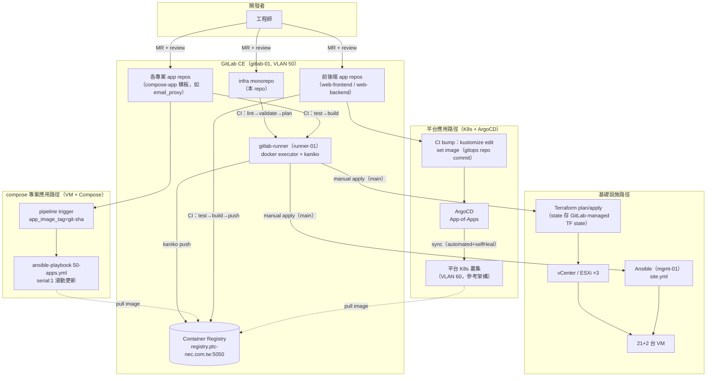

**兩條應用交付路徑的分工（ADR-4）**：

- **VM+Compose 型專案**（如 email_proxy：有狀態依賴多）：VM + Docker Compose，由 CI 觸發
  Ansible `50-apps.yml` 滾動部署。CI build 一次 → push registry → 各節點 pull（ADR-6）。
- **公司前後端**（無狀態 web 應用）：K8s + ArgoCD，CI 只負責 build image + 改 gitops repo
  的 image tag，ArgoCD 負責同步與自癒。

---

## 3. 平台組件架構（以 email_proxy 專案的資訊流為例）

平台組件全貌 + 第一個專案（email_proxy）的資訊流。新加入的組件：
**Kong API Gateway**（kong-01/02 @ VLAN 20，DB-less，北向由邊界 HAProxy 依 host 分流、
東西向走 kong-vip:8443）與 **SeaweedFS S3**（sw-01..03 @ VLAN 40，S3 VIP
`s3.{{domain}}:8333`，filer 元資料存 Patroni PG）。下圖為 email_proxy 使用中的組件：

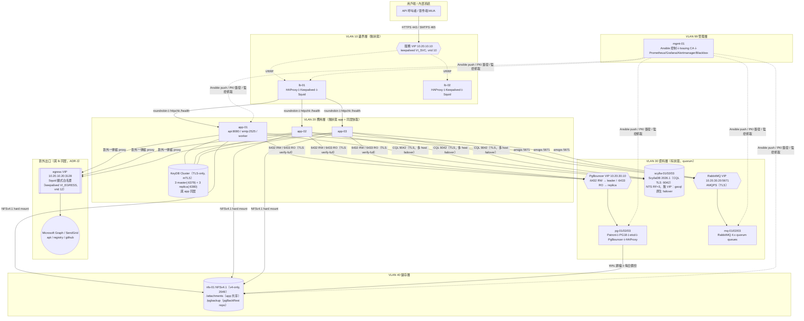

**寄信資料流（sequence）**：

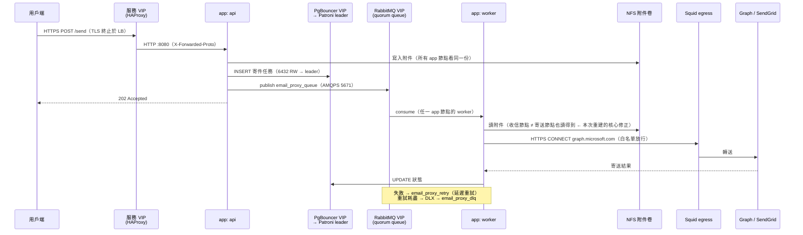

---

## 4. 網路規劃（VLAN / IP / 防火牆矩陣）

### 4.1 VLAN 切割

依**故障域與信任邊界**切分（規劃書 §3），不是一個大平面網段：

| VLAN | 網段 | 用途 | 對外可達性 |
|---|---|---|---|
| 10 邊界 | `10.20.10.0/24` | 服務 VIP、egress VIP、lb-01/02 | 用戶端可達（專案宣告的埠，現為 443/465） |
| 20 應用 | `10.20.20.0/24` | kong VIP + kong-01/02、各專案 app 節點（app-01..03 + KeyDB） | 僅 LB → Kong/App |
| 30 資料 | `10.20.30.0/24` | pg/mq/scylla 節點與 VIP | 僅 App、Kong、SW、mgmt |
| 40 儲存 | `10.20.40.0/24` | S3 VIP + sw-01..03、nfs-01 | 僅 App、PG、mgmt |
| 50 DevOps | `10.20.50.0/24` | gitlab-01、runner-01 | 開發者可達 443 |
| 60 平台 K8s | `10.20.60.0/24` | K8s 叢集（參考架構，見 §10） | Ingress |
| 99 管理 | `10.20.99.0/24` | mgmt-01、iLO/IPMI | 僅維運跳板 |

> 網段為規劃書示範值，全部參數化於 `ansible/inventories/prod/group_vars/all/vars.yml`
> 與 `terraform/environments/prod/variables.tf` —— 換成貴司實際網段只改變數。

### 4.2 IP 配置（CONVENTIONS.md §2 為唯一事實來源）

```text
10.20.10.10   svc-api.ptc-nec.com.tw        服務 VIP（443/465，keepalived vrid 10）
10.20.10.20   egress-proxy.ptc-nec.com.tw   Squid VIP（3128，vrid 12）
10.20.10.11-12  lb-01 / lb-02
10.20.20.20   kong-vip.ptc-nec.com.tw       Kong 東西向 VIP（8443，vrid 20）
10.20.20.21-22  kong-01 / kong-02
10.20.20.11-13  app-01 / app-02 / app-03（email_proxy 專案）
10.20.30.10   pgbouncer-vip.ptc-nec.com.tw  PG VIP（6432 RW / 6433 RO，vrid 30）
10.20.30.11-13  pg-01 / pg-02 / pg-03
10.20.30.20   rabbitmq-vip.ptc-nec.com.tw   MQ VIP（5671，vrid 31）
10.20.30.21-23  mq-01 / mq-02 / mq-03
10.20.30.31-33  scylla-01 / scylla-02 / scylla-03（無 VIP：gocql 多 host 原生 failover）
10.20.40.10   s3.ptc-nec.com.tw             SeaweedFS S3 VIP（8333，vrid 40）
10.20.40.11   nfs-01
10.20.40.21-23  sw-01 / sw-02 / sw-03
10.20.50.11   gitlab-01（gitlab.* 與 registry.* 同機）
10.20.50.12   runner-01
10.20.99.11   mgmt-01
```

### 4.3 東西向防火牆矩陣（最小開放原則）

| 來源 | 目的 | Port | 說明 |
|---|---|---|---|
| 用戶端 | 服務 VIP | 443, 465 | 唯一對外入口 |
| lb | app | 8080, 2525 | HTTPS/SMTP 後端 |
| app | pgbouncer-vip | 6432, 6433 | RW / RO（TLS） |
| app | rabbitmq-vip | 5671 | AMQPS（修正舊環境直連 25671） |
| app | nfs-01 | 2049 | NFSv4.1 **單一 port**（v4-only 設計，免 rpcbind） |
| app 節點內部 | 自己 | 6379/6380, 16379/16380 | KeyDB data + cluster bus（mTLS） |
| pg ↔ pg | pg | 5432, 8008, 2379/2380 | 複寫 + Patroni REST + etcd |
| pg | nfs-01 | 2049 | pgBackRest repo |
| mq ↔ mq | mq | 25672, 4369 | Erlang 叢集 |
| app | scylla | 9042, 19042 | CQL over TLS（19042 = gocql shard-aware） |
| scylla ↔ scylla | scylla | 7001 | internode mTLS（明文 7000 不監聽） |
| lb | kong | 8000, 8100 | 北向 API 轉發 + status 健檢（`check port 8100`） |
| app / 內部服務 | kong-vip | 8443 | 東西向 API 呼叫（TLS） |
| kong | 各專案後端 | 專案埠 | 例：kong → app:8080（依 projects 宣告逐行增列） |
| kong ↔ kong | kong | VRRP(112) | keepalived 單播心跳（ADR-7） |
| app / pg | s3 VIP + sw 節點 | 8333 | S3 API（TLS passthrough 後落節點 8333） |
| sw ↔ sw | sw | 9333/19333, 8380/18380, 8888/18888 | master raft / volume / filer（VLAN 40 內部） |
| sw | pgbouncer-vip | 6432 | filer 元資料庫（TLS） |
| app / lb | egress VIP | 3128 | 唯一對外出口 |
| mgmt | 全部 | 22 | Ansible / 維運 |
| mgmt | 全部 | 9100, 8008, 15692, 8404, 9180, 9090.. | 監控抓取（詳見 §14） |
| runner | gitlab | 443, 5050 | CI ↔ Git/Registry |

**埠共存原則**（實測踩雷後寫入契約 CONVENTIONS §3）：VIP 所在主機上「後端服務」與「HAProxy」
常同埠（PgBouncer 6432 vs VIP:6432）。規則：**服務綁自己的節點 IP（+127.0.0.1），HAProxy 綁 VIP**，
且所有節點開 `net.ipv4.ip_nonlocal_bind=1`（BACKUP 節點也要能綁 VIP 埠）。

---

## 5. VMware 資源與 Terraform

### 5.1 ESXi 故障域與反親和（規劃書 §2.1）

最少 **3 台 ESXi**：任一台故障時，所有三節點 quorum 叢集（etcd/Patroni/RabbitMQ/KeyDB/ScyllaDB）
最多掉 1 個成員、不失去多數。由 `terraform/modules/anti_affinity` 落地 5 組規則：

| 規則 | 成員 | 理由 |
|---|---|---|
| `AA-postgres` | pg-01/02/03 | Patroni + etcd quorum |
| `AA-rabbitmq` | mq-01/02/03 | quorum queue Raft 多數 |
| `AA-scylladb` | scylla-01/02/03 | RF=3 + QUORUM 讀寫多數 |
| `AA-seaweedfs` | sw-01/02/03 | master raft 多數 + 010 複寫的兩副本落點分散 |
| `AA-app` | app-01/02/03 | 同居的 KeyDB cluster 也要分散 |
| `AA-lb` | lb-01/02 | VIP 主備不可同機 |
| `AA-kong` | kong-01/02 | VI_KONG 主備不可同機 |

> 反親和用 `mandatory=false`（should 規則）：3 台 ESXi = 叢集成員數時，must 規則會擋
> 維護模式 vMotion 與 HA 故障重啟。ESXi > 3 台時可覆寫變數改成 must。（模組內有完整註解）

### 5.2 VM 清單（23 台 = 邊界 2 + Kong 2 + app 3 + 資料層 9 + 儲存 4 + DevOps 2 + 管理 1）

| VM | 角色 | vCPU | RAM | OS 碟 | 資料碟 | VLAN |
|---|---|---|---|---|---|---|
| lb-01/02 | HAProxy+Keepalived+Squid | 2 | 4G | 40G | — | 10 |
| kong-01/02 | Kong DB-less（Docker）+Keepalived | 2 | 4G | 40G | — | 20 |
| app-01..03 | email_proxy：api/worker/smtp + KeyDB | 4 | 8G | 60G | — | 20 |
| pg-01..03 | Patroni/PG18+etcd+PgBouncer+HAProxy | 6 | 16G | 40G | 200G data + 50G WAL + 10G etcd（**各自獨立 PVSCSI 控制器**，SSD） | 30 |
| mq-01..03 | RabbitMQ 4.x | 4 | 8G | 40G | 100G | 30 |
| scylla-01..03 | ScyllaDB 2026.1（Docker） | 4 | 16G | 40G | 500G（獨立 PVSCSI 控制器，SSD，XFS） | 30 |
| nfs-01 | NFSv4.1 | 2 | 8G | 40G | 500G–1T | 40 |
| sw-01..03 | SeaweedFS（master+volume+filer+s3，Docker） | 4 | 8G | 40G | 1T（thin，獨立 PVSCSI） | 40 |
| gitlab-01 | GitLab CE + Registry | 4 | 8G | 100G | 200G | 50 |
| runner-01 | gitlab-runner | 4 | 8G | 60G | — | 50 |
| mgmt-01 | Ansible+PKI+監控 | 4 | 8G | 100G | 200G TSDB | 99 |

磁碟最佳實踐（`terraform/modules/vm`，規劃書 §2.3）：

- PG 的 data/WAL/etcd **各掛獨立 PVSCSI 控制器**（WAL 寫入不與資料查詢搶 IO queue）。
- 有狀態資料碟 `independent_persistent`（**排除在 VM 快照之外**——DB 備份走 pgBackRest，
  不用 VM 快照）＋ `keep_on_remove`（terraform destroy 不刪資料 VMDK）。
- etcd/PG WAL 對 fsync 延遲極敏感 → pg 節點整台放 SSD/NVMe datastore（`datastore_ssd` 變數）。
- ScyllaDB 同理整台放 `datastore_ssd`：500G 資料碟走獨立 PVSCSI 控制器、thick、
  `independent_persistent`（比照 pg/mq；guest 內 mkfs.xfs 掛載由 `block_storage` role 處理）。

### 5.3 Terraform 結構與流程

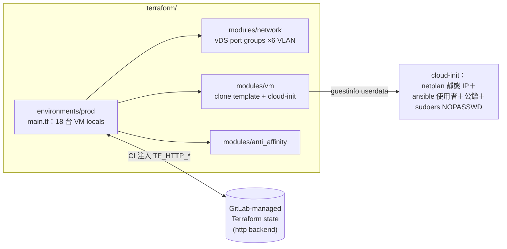

- **cloud-init 產出 = Ansible 的起點**：`ansible` 使用者 + mgmt-01 公鑰 + `NOPASSWD` sudoers，
  跟實驗室 Dockerfile 的產出完全同構——「實驗室的第一步 = prod 的第一步」。
- `outputs.tf` 有 `rendered_ansible_inventory`：渲染出 hosts.yml 樣式的清單**供人工比對**；
  inventory 本身仍是手寫的唯一事實來源（ADR-1）。
- 驗證：`make tf-validate`（用官方 Docker image，本機不用裝 Terraform）。

---

## 6. PKI：單一信任根

取代舊環境「每個服務各自一個 CA、100 年效期」的碎片化（規劃書 §5）。

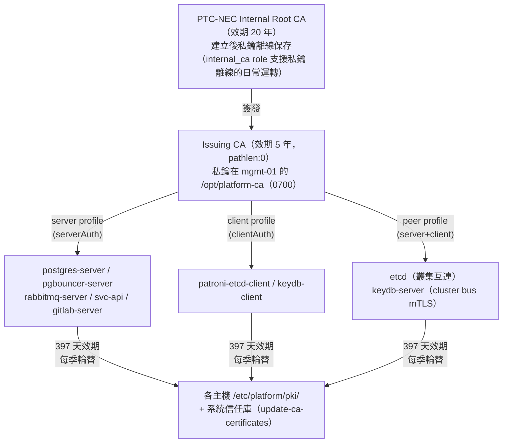

關鍵設計（`roles/internal_ca` + `roles/pki_leaf`）：

- **私鑰永不離開目標主機**：key + CSR 在目標機生成 → 只有 CSR（公開資訊）被送到 mgmt-01
  簽發 → 簽好的 crt 送回。controller 磁碟全程不落地任何私鑰。
- **SAN 完整**：FQDN + 短名 + 節點 IP；面向 VIP 的服務（pgbouncer/rabbitmq/svc-api）additionally
  含 VIP 名稱與 VIP IP —— client 用 `verify-full` 嚴格驗證也通過（實驗室實測）。
- **葉憑證 397 天**（現代 TLS 上限相容）；重跑 `10-pki.yml` 對未到期憑證**不重簽**（冪等），
  主動輪替用 `-e pki_leaf_force_renew=true`（見 §15 runbook）。
- 憑證更新會設 host fact `pki_certs_changed=true`，同一次 site.yml 內所有 TLS 服務
  的「橋接 task」據此自動 reload —— 輪替不需要人工重啟每個服務。
- 到期兜底：Blackbox exporter 探測 TLS 端點，**到期前 30 天告警**（§14）。

各主機領的憑證清單見 `ansible/CONVENTIONS.md` §5。

---

## 7. 資料層深潛（PG / MQ / KeyDB）

### 7.1 PostgreSQL HA：一台 pg 節點上有五個角色

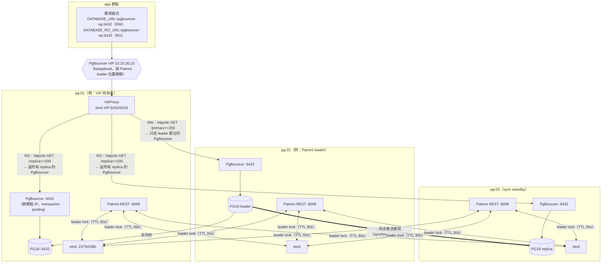

**分層職責**（junior 必懂）：

- **Keepalived** 只決定「app 的封包進哪台的 HAProxy」——VIP 漂移**不會**造成資料面切換。
- **HAProxy** 依 Patroni REST 健檢（`/primary`、`/replica`）決定「連線送到哪台的 PgBouncer」，
  `on-marked-down shutdown-sessions` 在 failover 時立刻斬斷舊 leader 連線逼 app 重連。
- **PgBouncer** 只連「本機」PG，負責連線池（transaction pooling）；
  認證走 `auth_query`（SECURITY DEFINER 函數），使用者密碼只存 PG 一處。
- **Patroni** 管 leader 選舉與複寫（`synchronous_mode: true` → RPO=0）；
  **etcd** 是投票箱（leader lock、叢集狀態）。

**Failover 時序（實驗室可用 `patronictl switchover` 演練）**：

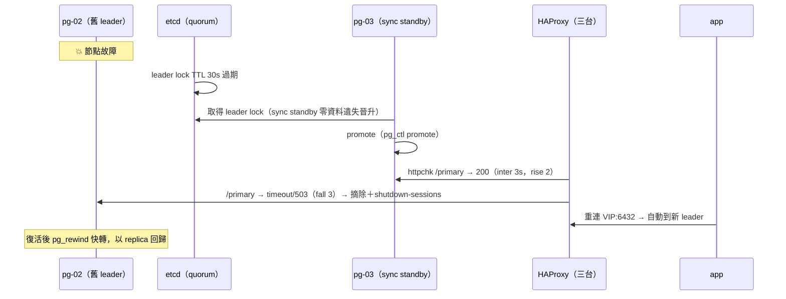

### 7.2 RabbitMQ 4.x

- **quorum queues**（Raft 多數複寫）：`email_proxy_queue` / `email_proxy_retry` / `email_proxy_dlq`，
  失敗訊息經 `email_proxy_dlx`（fanout DLX）進 DLQ。
- 明文 AMQP **全關**（`listeners.tcp = none`），只留 AMQPS 5671（內部 CA 憑證）。
- App 連 **VIP:5671**（修正舊環境直連個別節點 25671 的錯誤）；HAProxy TCP 分流 + tcp-check。
- `cluster_partition_handling = pause_minority`：三節點裂腦防護標準解。
- delayed-message plugin（重試機制依賴）由 role 下載安裝，版本與 URL 皆為變數。

### 7.3 KeyDB（3 master + 3 replica，修正規劃書 §10.10）

- 每台 app 節點：1 master（:6379）+ 1 replica（:6380），`--cluster-replicas 1` 建叢集時
  自動把 replica 配到「別台」的 master（IP 反親和）→ 任一 app 節點整台故障，
  其 1/3 slot 由他台 replica 自動接手。
- **TLS-only + mTLS**（`port 0` + `tls-auth-clients yes`）+ `requirepass`：三層防護。
- 純快取語意：`appendonly no`、`save ""`、`maxmemory-policy volatile-lru`。
- 跑在 Docker 容器（app 節點本來就有 Docker）；`cluster-announce-ip` 顯式宣告節點 IP。

---

## 8. 部署指南

### 8.1 前置需求（prod）

1. vCenter 就緒、≥3 台 ESXi、SSD datastore、ubuntu-26.04 VM template（含 cloud-init）。OS 全平台統一 Ubuntu。
2. GitLab 專案建立（本 repo push 上去）、runner 註冊、CI variables 設定（見 §9.3）。
3. `ansible/.vault_pass`：**產生新密碼並 rekey**（repo 附的 vault 是佔位值，見 §11）。
4. mgmt-01 由 Terraform 先建出來後，成為之後所有 Ansible 操作的控制節點。

### 8.2 部署順序（依賴 DAG）

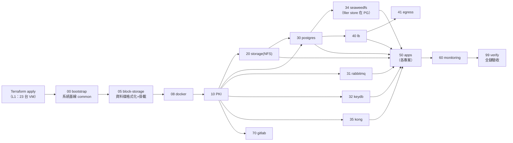

> **階段 05/08 的順序關鍵**：`05-block-storage` 把 Terraform 掛上的資料 VMDK 在 guest 內
> 格式化（xfs）並掛到服務資料目錄，**必須在服務安裝前**（否則服務先在 OS 碟建資料、碟再掛上去就遮蔽）。
> `08-docker` 排在 05 之後，是為了讓 mgmt-01 的監控碟能先掛到 `/var/lib/docker`，Docker 的
> TSDB named volume 就自動落在大碟。lab（容器無 block device）在 05 整段 `is_container` 跳過。

```bash
# ---- L1：機器的存在（在 CI 跑，或本機） ----
cd terraform/environments/prod
terraform init && terraform plan -out=tfplan   # plan 必須人工 review
terraform apply tfplan

# ---- L2/L3：機器的內容（在 mgmt-01 上） ----
cd ansible
ansible-galaxy collection install -r requirements.yml -p collections
ansible-playbook playbooks/site.yml            # 一鍵全站（預設打 prod inventory）

# 或分階段：
ansible-playbook playbooks/30-postgres.yml     # 單一階段
ansible-playbook playbooks/99-verify.yml       # 隨時可跑的全鏈健檢
ansible-playbook playbooks/99-verify.yml --tags verify-pg   # 單一子系統健檢
```

> **首次全新部署的雞生蛋注意**：`00-bootstrap` 的 apt 走 egress proxy，但 Squid 要到
> `41-egress` 才部署。首跑用 `-e use_egress_proxy=false`（或確保既存 proxy 可用），
> 41 完成後重跑 `00-bootstrap` 收斂 proxy 設定。（實驗室因直連 NAT 天然無此問題）

### 8.3 常用指令（`make help` 看全部）

```bash
make deps          # 安裝 collections
make lint          # yamllint + ansible-lint（production profile）
make syntax        # 兩套 inventory 語法檢查
make tf-validate   # terraform fmt+validate（官方 docker image）
make argocd-validate  # kubeconform
make check-all     # 以上全部（= CI 的 validate 階段）
make lab-up        # 起 16 節點實驗室
make lab-deploy    # 對實驗室跑 site.yml
make lab-verify    # 只跑 99-verify
make lab-destroy   # 銷毀實驗室
```

---

## 9. GitLab CI / CD 管線

### 9.1 本 repo 的管線（`.gitlab-ci.yml`）

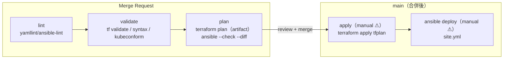

- `rules:changes` 分流：只動 `terraform/**` 就只跑 terraform jobs，依此類推。
- **apply 一律 manual**：「plan 看過才按」是 GitOps 紀律的底線。
- Terraform state 存 **GitLab-managed Terraform state**（http backend，
  `TF_HTTP_ADDRESS=${CI_API_V4_URL}/projects/${CI_PROJECT_ID}/terraform/state/prod`），
  免自建 state 後端、天然有鎖與版本。

### 9.2 應用 repo 模板（`gitlab/ci-templates/`）

| 模板 | 用途 | 交付終點 |
|---|---|---|
| `docker-build.gitlab-ci.yml` | **kaniko** 建映像（無需 privileged/DinD——地端 runner 安全最佳實踐） | registry |
| `compose-app.gitlab-ci.yml` | VM+Compose 型專案（PROJECT_SLUG 參數化）：test → build → image → **trigger 本 repo 的 50-apps 部署** | VM（Compose） |
| `backend.gitlab-ci.yml` | Go 後端：test → image → **kustomize bump gitops repo** | K8s（ArgoCD） |
| `frontend.gitlab-ci.yml` | Node 前端：lint/test/build → image → bump | K8s（ArgoCD） |

compose 型專案的映像流（ADR-6；以 email_proxy 為例）：

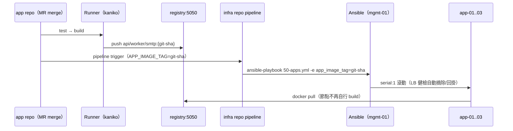

### 9.3 CI 需要的 Variables（Settings → CI/CD → Variables）

| 變數 | 類型 | 用途 |
|---|---|---|
| `SSH_PRIVATE_KEY` | File | mgmt/目標機部署金鑰（`ansible` 使用者） |
| `SSH_KNOWN_HOSTS` | File | 保住 `host_key_checking=True`（MITM 防護不能為 CI 讓路） |
| `ANSIBLE_VAULT_PASS_FILE` | File | vault 密碼 |
| `VSPHERE_USER` / `VSPHERE_PASSWORD` | Masked | terraform provider |
| `INTERNAL_CA_PEM` | File | kaniko 信任內部 registry |

---

## 10. ArgoCD 與平台 K8s

`argocd/` 是 gitops repo 的內容藍本（App-of-Apps 模式）：

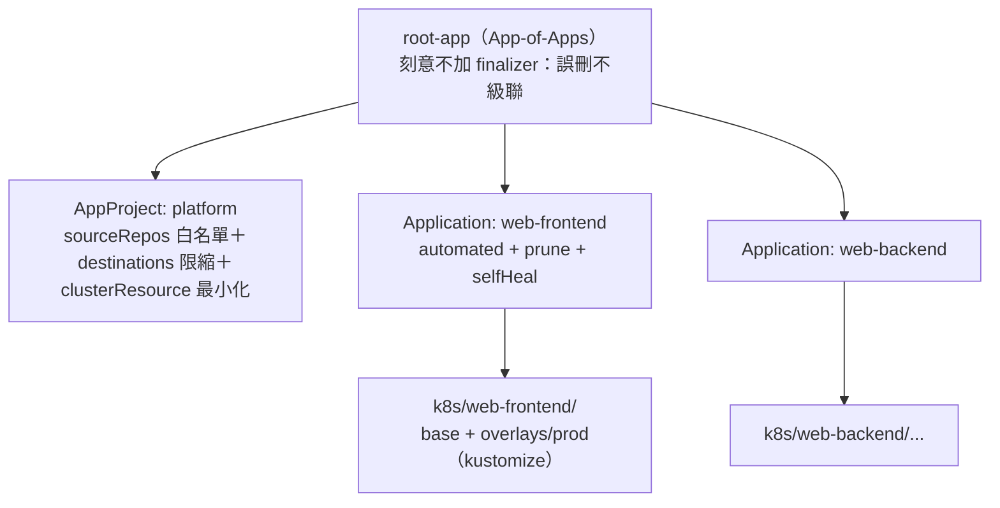

- 部署三步驟見 [`argocd/bootstrap/README.md`](argocd/bootstrap/README.md)（含離線環境映像搬運）。
- CI 的 bump job 用 `kustomize edit set image` 改 overlay 的 tag → commit → ArgoCD 自動同步。
- **VM+Compose 型專案（如 email_proxy）刻意不在 K8s**（ADR-4）：詳見 §16。

---

## 11. 機密管理（ansible-vault）

- 機密分兩層（CONVENTIONS §6）：**平台機密** `vault.yml` + **每專案一檔**的
  `vault_prj_<name>.yml`（Git 內都是密文）。`vars.yml`（平台）與
  `project_<name>.yml`（專案）只放 `xxx: "{{ vault_xxx }}"` 別名，role 一律引用別名。
- **每個服務獨立強密碼**（修正舊環境共用弱密碼）；VRRP 密碼固定 8 字元（協定上限）。
- 兩把鑰匙：`prod@ansible/.vault_pass`（**不進 Git**）、`lab@ansible/lab/vault_pass.txt`
  （刻意進 Git——lab 機密只是佔位值，任何人可一鍵起實驗室）。

```bash
# 日常操作（在 ansible/ 目錄）
ansible-vault view  inventories/prod/group_vars/all/vault.yml            # 平台機密
ansible-vault view  inventories/prod/group_vars/all/vault_prj_email_proxy.yml  # 專案機密
ansible-vault edit  inventories/prod/group_vars/all/vault.yml

# ★ 接手本 repo 的第一件事：換掉佔位機密
openssl rand -base64 24 > .vault_pass && chmod 600 .vault_pass   # 產生新鑰匙
ansible-vault rekey --new-vault-id prod@.vault_pass inventories/prod/group_vars/all/vault.yml
ansible-vault edit inventories/prod/group_vars/all/vault.yml     # 逐項換新值
# 然後重跑 site.yml 讓新密碼佈達（服務密碼輪替 runbook 見 §15）
```

明文結構範本：`vault.yml.example`（平台）與 `vault_prj_email_proxy.yml.example`（專案）。

---

## 12. Docker 實驗室（驗證過的拓撲）

**「實驗室驗證的就是正式環境的拓撲」**：21 節點、5 VLAN、IP 與 prod 完全相同、
TLS/quorum/VIP 一個不少。lab inventory 的拓撲檔全部 **symlink** 到 prod（單一事實來源），
只覆寫降規參數（`zz_lab_overrides.yml`）。

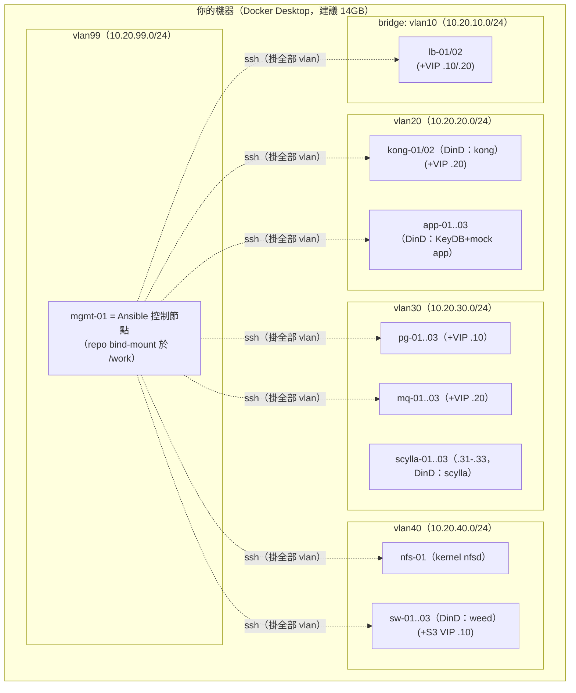

```bash
make lab-up        # build 映像（ubuntu:26.04+systemd+sshd）→ 起 21 容器 → ssh 就緒檢查
make lab-deploy    # 在 mgmt-01 內對全實驗室跑 site.yml（20-25 分鐘）
make lab-verify    # 99-verify 全鏈驗收
make lab-sh        # 進 mgmt-01（cd /work/ansible 改了就能重跑——bind mount 同一份 code）
make lab-destroy
```

**與 prod 的已知差異（誠實記錄，均有對應處理）**：

| 差異 | lab | prod | 處理 |
|---|---|---|---|
| 跨 VLAN 連通 | 多重掛網（節點多網卡） | 單網卡 + L3 路由 + ACL | role 內網卡一律動態偵測（CONVENTIONS §8-8） |
| NFS export ACL 來源網段 | 節點的 vlan40 腳 | 真實 app/資料網段 | `nfs_*_clients` 變數，lab 覆寫 |
| kernel 級調校 | 跳過（共用宿主 kernel） | 全套 | `is_container` guard |
| GitLab / runner | 不部署（記憶體） | 部署 | lab inventory 無此群組，自動跳過 |
| app 映像 | 本地 build mock（/health+SMTP banner） | registry pull | `compose_app_mock_projects` 開關 |
| Docker 影像存放層 | overlay2（巢狀相容） | 預設 | `docker_storage_driver` 變數 |
| ScyllaDB 運行模式 | developer mode（DinD/overlay 過不了 XFS/AIO 檢查）+ smp1/768M | **正式模式**（dev mode 是 MIS 反模式，prod 必 false）+ smp2/8G | `scylla_developer_mode` 等，lab 覆寫 |

**驗收證據（16 節點時代最後一次完整跑）**：`site.yml` 全綠、`99-verify` 十個子系統全過、
`ansible-lint` production profile 0 findings、site.yml 重跑收斂（冪等）。
> ⚠️ 2026-08 平台化改造（projects 層、Kong、SeaweedFS、PG 擴充、21 節點）後
> **尚未重跑 lab 全鏈**——static 檢查全綠（lint/syntax/模板渲染/變數求值），
> 但「lab 全鏈實測是唯一可信驗證」是本 repo 的一貫哲學，上 prod 前必補。

---

## 13. 備份與復原

| 面向 | 做法 | 位置 |
|---|---|---|
| **PostgreSQL** | pgBackRest：WAL 連續歸檔（`archive_command`）+ 每週日全備 + 每日差異備，`repo1-retention-full=2` ≈ 兩週 PITR 窗口；repo **AES-256 加密**（NFS 上靜態加密）。S3（SeaweedFS）只能當 repo2 次要庫——filer 元資料在 PG 內，還原主路徑必須是 NFS（CONVENTIONS §10.6） | nfs-01 `/export/pgbackup` |
| **RabbitMQ** | definitions（vhost/user/queue/policy）由 Ansible 冪等重建 = 設定即備份；quorum queue 資料靠叢集多數複寫 | Git（本 repo） |
| **KeyDB** | 純快取（TTL 語意），不備份 | — |
| **ScyllaDB** | RF=3 保「節點故障」不保「邏輯錯誤」（誤刪表全叢集同步刪）。**快照策略待決策**：`nodetool snapshot` + 異地拷貝的排程尚未實作（MIS 現況亦無備份——這是已知債，不是刻意設計）；上線承載正式資料前必須補上 | TODO |
| **附件（email_proxy）** | NFS 卷每日增量備份到異地（站點既有備份系統，掛載點即備份源） | nfs-01 |
| **SeaweedFS** | replication=010 保「節點故障」不保「邏輯錯誤」；物件層備份策略待決策（比照 Scylla 的已知債） | TODO |
| **GitLab** | `gitlab-backup create` + 異地同步（runbook TODO 註記於 role） | gitlab-01 |
| **CA** | Root CA 私鑰離線保存（建立後搬離 mgmt-01）；Issuing CA 隨 mgmt-01 的檔案系統備份 | 離線媒體 |

**PG 完整還原劇本（PITR）**：

```bash
# 在目標 pg 節點（假設整叢集重建）：
sudo systemctl stop patroni
sudo -u postgres pgbackrest --stanza=pg-main --delta \
     --type=time "--target=2026-07-05 08:00:00+08" restore
# Patroni 需要先清 DCS 叢集狀態再以還原後的資料目錄重新 bootstrap：
patronictl -c /etc/patroni/config.yml remove pg-main   # 確認提示
sudo systemctl start patroni    # 首節點成為新 leader，其他節點自動重建副本
```

> 備份的黃金法則：**沒演練過的備份 = 沒有備份**。實驗室就是演練場——
> `make lab-up` 後照上面劇本演一次，全程無風險。

---

## 14. 監控與告警

mgmt-01 上的 compose（`roles/monitoring`）：Prometheus + Grafana + Alertmanager + Blackbox。

| 抓取目標 | 端點 | 涵蓋 |
|---|---|---|
| node_exporter | 全部主機 `:9100` | CPU/記憶體/磁碟/網路 |
| Patroni | pg 節點 `:8008/metrics` | leader 狀態、複寫延遲、timeline |
| **etcd** | pg 節點 `:2381/metrics`（獨立明文端點） | has_leader、換主次數、**WAL fsync 延遲**（§2.1 敏感點） |
| RabbitMQ | mq 節點 `:15692/metrics` | 佇列深度、節點狀態、記憶體水位 |
| **KeyDB** | app 節點 `:9121`（redis_exporter，mTLS 連本機 master） | redis_up、**connected_slaves**（replica 備援）、記憶體 |
| HAProxy | lb/pg/mq 節點 `:8404/metrics`（內建 exporter） | 後端健康、連線數、5xx |
| **ScyllaDB** | scylla 節點 `:9180/metrics`（Seastar 原生，免 exporter） | operation_mode、讀寫 timeout、壓實/空間壓力 |
| **Kong** | kong 節點 `:8100/metrics`（prometheus plugin） | 請求量/延遲/5xx 比率、upstream target 健康 |
| **SeaweedFS** | sw 節點 `:9327/metrics`（weed 原生） | volume 空間、S3 請求、filer 延遲 |
| Blackbox | 各專案宣告的探測（如 `https://svc-api/health`）、`amqps VIP:5671`（TLS）、`kong-vip:8443`（TLS）、`s3:8333`（TLS）、`pgbouncer VIP:6432`、`egress VIP:3128`（tcp）、scylla 各節點 `:9042`（TLS） | VIP／CQL 端到端可達性 + **憑證到期天數** |

**告警規則**（`roles/monitoring/templates/rules.yml.j2`，每條附中文註解）：

| 告警 | 條件 | 嚴重度 |
|---|---|---|
| InstanceDown | `up == 0` for 2m | critical |
| **CertExpirySoon** | 憑證 30 天內到期（規劃書 §9） | warning |
| PatroniClusterNoLeader | `sum(patroni_master) != 1` for 1m（涵蓋無主與腦裂） | critical |
| **EtcdNoLeader** | `max(etcd_server_has_leader) == 0` for 1m（DCS 根因，比 Patroni 更上游） | critical |
| **EtcdSlowFsync** | WAL fsync p99 > 500ms for 5m（datastore 非 SSD 的預警） | warning |
| RabbitNodeDown | 叢集在線節點 < 3 for 3m | critical |
| **KeyDBMasterNoReplica** | `redis_connected_slaves < 1`（master 失去備援即告警，補審查點名盲點） | warning |
| **ScyllaNodeNotNormal** | `scylla_node_operation_mode != 3` for 10m（節點離開 NORMAL＝再倒一台就 QUORUM 不足） | warning |
| ProbeFailed | 端到端探測失敗 for 3m（涵蓋 6 個 VIP「沒人持有」） | critical |
| **KongUpstreamTargetUnhealthy** | Kong 視角的後端 target 不健康 for 5m | warning |
| **KongHigh5xxRatio** | 經 Kong 的 5xx 比率 > 5% for 5m | warning |
| NodeFilesystemAlmostFull | 可用 < 15% for 10m | warning |

Grafana：`http://mgmt-01:3000`（admin 密碼在 vault）；Prometheus：`:9090`；Alertmanager：`:9093`
（預設 null receiver，接上 email/Slack 的完整範例在 alertmanager.yml 註解內）。

---

## 15. 維運 Runbook

### 15.1 日常變更（GitOps 流程）

```text
改 Git（role/vars）→ MR → CI lint/validate/plan（--check --diff）→ review → merge
→ CI manual apply（或在 mgmt-01 手動 ansible-playbook）→ 99-verify
```

### 15.2 憑證輪替（每季）

```bash
ansible-playbook playbooks/10-pki.yml -e pki_leaf_force_renew=true   # 重簽全部葉憑證
ansible-playbook playbooks/site.yml                                   # 各服務的橋接 task 自動 reload
ansible-playbook playbooks/99-verify.yml --tags verify-pki            # 驗證新效期
```

> 注意：橋接 task（`pki_certs_changed` → reload）只在「同一次執行」內生效。
> 單獨跑完 10-pki 就收工的話，服務還抱著舊憑證直到下次 reload——**永遠接著跑 site.yml**。

### 15.3 滾動重啟資料層（計畫性維護）

```bash
# quorum 型叢集絕不三台同時動——用 --limit 逐台，等健康再下一台：
ansible-playbook playbooks/30-postgres.yml --limit pg-03      # 先動 replica
ansible-playbook playbooks/99-verify.yml --tags verify-pg
ansible-playbook playbooks/30-postgres.yml --limit pg-02
# leader 那台先手動 switchover 再動：
ssh pg-01 'patronictl -c /etc/patroni/config.yml switchover --candidate pg-03 --force'
ansible-playbook playbooks/30-postgres.yml --limit pg-01
```

### 15.4 Failover 演練（實驗室隨時可做）

```bash
docker stop platform-pg-02           # 模擬 leader 整機死亡
make lab-verify                      # ~40 秒內（TTL 30s + 健檢窗）新 leader 上任，全鏈仍綠
docker start platform-pg-02          # 舊 leader pg_rewind 後以 replica 回歸
```

### 15.5 新機納管

1. Terraform 加 VM（locals）→ MR → apply。
2. `inventories/prod/hosts.yml` 加主機（唯一事實來源）。
3. mgmt-01：`ssh-keyscan <ip> >> ~/.ssh/known_hosts`（`host_key_checking=True` 是刻意的）。
4. `ansible-playbook playbooks/site.yml --limit <新主機>,mgmt-01`。

### 15.6 服務密碼輪替

```bash
ansible-vault edit inventories/prod/group_vars/all/vault.yml   # 換 vault_xxx_password
ansible-playbook playbooks/site.yml        # 冪等收斂：PG 使用者、RabbitMQ 使用者、KeyDB requirepass、
                                           # PgBouncer userlist、app .env 全部跟著新值走
```

---

## 16. ADR 設計決策記錄

回答規劃書 §10 的六個開放問題 + 實作過程的重大決策：

| # | 決策 | 理由（與取捨） |
|---|---|---|
| **ADR-1** | 網段沿用 `10.20.0.0/16` 示範值，全參數化 | 規劃書 §10.1：真實網段只改 `group_vars/all/vars.yml` + terraform 變數，一處一改 |
| **ADR-2** | 全部基礎服務用 **Ubuntu 26.04 官方 archive 套件**（PG18/Patroni 4.1/RabbitMQ 4.0.5/etcd 3.5/HAProxy 3.2…），Docker 只裝在跑容器的節點（app/mgmt/runner） | 地端封閉環境最小化第三方 repo = 最小化供應鏈與 egress 依賴。實測 26.04 archive 版本全數符合規劃書要求。PGDG 作為次要選項保留（要 minor 版鎖定時） |
| **ADR-3** | egress Squid **與 lb 同居** + 獨立 VIP（規劃書 §10.3） | 主備 VIP 消除單台 Squid SPOF，又不用多開 2 台 VM；兩者同為無狀態邊界元件，故障域重疊可接受 |
| **ADR-4** | PKI 先落地 **openssl（community.crypto）版**；ArgoCD 只管平台 K8s，VM+Compose 型專案（如 email_proxy）留在 VM | step-ca/Vault PKI 留為中期演進（role 介面已預留）；依賴 NFS/host network/VIP 拓撲的專案強行進 K8s 是為了工具而工具 |
| **ADR-5** | 名稱解析：**Ansible 管理 /etc/hosts**（規劃書 §10.5） | 16 台規模下比自建 DNS 簡單可靠；公司 DNS 就緒後設 `manage_etc_hosts=false` 即可切換 |
| **ADR-6** | 映像：**CI build 一次 → push 內部 registry → 節點 pull**（規劃書 §10.6），registry = GitLab 內建 | 消除「各節點自行 build」的版本漂移與重複勞動；GitLab 已自建，registry 零額外成本 |
| ADR-7 | Keepalived 用 **unicast VRRP**（顯式 peers） | 不依賴交換器放行 224.0.0.18 多播；跨機房/容器/雲一體適用；peers 由 inventory 動態展開 |
| ADR-8 | KeyDB 跑容器、其餘服務原生 systemd | KeyDB 無 26.04 套件；app 節點本來就有 Docker；資料層服務原生跑（少一層抽象、systemd 資源控制直接） |
| ADR-9 | NFSv4-only + 顯式 `fsid=0` pseudo-root + 各匯出自我 bind-mount | v4-only 單埠 2049；顯式 pseudo-root 讓 prod 與 lab 行為一致；bind-mount 是「同檔案系統巢狀匯出」正確套用各自選項的 kernel 要求（實測） |
| ADR-10 | NFS 匯出 `all_squash,anonuid=1000` | 各節點服務帳號 UID 不一致是 NFS 最經典地雷——統一映射到附件擁有者，且 client 被入侵拿到 root 也只是 1000 |
| ADR-11 | 反親和 should（非 must） | 3 台 ESXi = 成員數時 must 擋維護模式與 HA 重啟；>3 台可覆寫 |
| ADR-12 | lab 拓撲檔 symlink prod | 「驗證的就是部署的」——兩份拓撲遲早漂移 |
| ADR-13 | 資料碟由 `block_storage` role 在 guest 內 mkfs+掛載（xfs，依容量認碟，UUID 寫 fstab） | Terraform 只負責「掛 VMDK」，guest 內格式化/掛載是 OS 組態職責。同機資料碟容量互異 → 用容量精確認碟，不賭裝置命名順序或 PCI by-path。對抗式審查抓到的原設計缺口（見 §17-16） |
| **ADR-14** | 多專案化：平台層 = inventory 空群組開關的組件選單；專案層 = `projects` 登記簿純資料宣告（CONVENTIONS §10） | 專案不擁有 play/role，加專案 = 加宣告檔；`hash_behaviour=replace` 之下用「每專案一檔 + 聚合器」避免 dict 覆蓋地雷。email_proxy 降為第一個專案實例 |
| **ADR-15** | Kong 走 **DB-less**（宣告式 kong.yml 由 projects 渲染）+ 專用 kong-01/02 @ VLAN 20 | Admin API 唯讀 = 結構性消滅路由 drift；不反向依賴資料層。已知限制：oauth2 plugin 不支援 DB-less（JWT/key-auth/ACL/限流都支援），需要時才重訪 DB-backed。否決同居 lb（故障域重疊、擴 Kong 被迫動邊界） |
| **ADR-16** | 物件儲存選 **SeaweedFS**（Apache-2.0）而非原規劃的 MinIO：3 節點 master raft + volume（replication=010）+ filer/S3（元資料在 Patroni PG） | MinIO 社群版 2026-04 遭上游 archive（無 CVE 修補、console 遭閹割）——供應鏈風險不適合全新平台。對外只暴露 S3 endpoint + projects 宣告，日後換牌只動 role 內部。代價：filer 依賴 PG → S3 永遠只能當 pgBackRest 的次要備份庫 |

### 對抗式審查（多維度 + 逐項驗證）

實驗室全綠後，另跑一輪對抗式審查（安全 / prod-lab 分歧 / 規劃書合規 / 維運正確性四維度平行找問題，
每個 finding 再由獨立「懷疑者」進實驗室查證後才採信）。確認並修正的 3 個 **prod-only 缺口**
（都是「實驗室是容器所以驗不出」的類別，正是這輪審查的價值）：

1. **資料碟未掛載（HIGH）**：Terraform 掛了 VMDK 但無 role 在 guest 內格式化/掛載 → prod 資料
   全落 OS 碟、資料不在 `independent_persistent` 碟上（VM 重建即丟）。**修**：新增 `block_storage`
   role + `05-block-storage` 階段（ADR-13）。
2. **etcd/KeyDB 無指標（MEDIUM）**：規劃書 §9 承諾的 exporter 未交付 → KeyDB replica 失效卻靜默、
   etcd fsync 劣化無感。**修**：etcd 獨立 metrics 端點 + KeyDB redis_exporter + `KeyDBMasterNoReplica`
   / `EtcdNoLeader` / `EtcdSlowFsync` 告警（§14）。
3. **VIP 位置告警未交付（MEDIUM）**：規劃書 §9 明列，且 pgbouncer/egress VIP 無探測。**修**：
   blackbox 補這兩個 VIP 的 tcp 探測，`ProbeFailed` 涵蓋 4 個 VIP（§14）。

---

## 17. 實測踩雷實錄（除錯知識庫）

本專案在 13 節點實驗室**真實部署**過程中踩到並修正的問題——每一條都已固化為程式碼與註解，
留在這裡是給 junior 的「為什麼程式碼長這樣」考古索引：

| # | 症狀 | 根因 | 修正（程式碼所在） |
|---|---|---|---|
| 1 | blockinfile 改 /etc/hosts 報 `EBUSY` | 容器內 /etc/hosts 是 bind mount，原子 rename 跨 mount 失敗 | `unsafe_writes: "{{ is_container }}"`（common） |
| 2 | 憑證鏈驗證失敗 `wrong tag` | Jinja 表達式串 `'\n'` 落地成字面反斜線+n，PEM 之間沒有真換行 | chain/bundle 全改 YAML literal block（internal_ca / pki_leaf） |
| 3 | community.crypto 模組報缺 cryptography | 目標機沒有 python3-cryptography | 加入 common 基線套件 |
| 4 | `become_user postgres` 報 tmp 權限錯誤 | 目標機缺 `acl` 套件（setfacl） | 加入 common 基線套件 |
| 5 | Patroni 起不來：`DCS not found` | Debian 把 DCS Python 依賴拆包 | `python3-etcd` 進 patroni 套件清單 |
| 6 | Patroni 服務 activating 卡死→被 systemd 反覆砍 | unit 是 `Type=notify` 但缺 `python3-systemd`（sd_notify 發不出去） | 加套件（patroni defaults） |
| 7 | promote 時 journal 反覆報 pg_hba 拒絕 | Patroni 本機 replication 健檢走 loopback 非 TLS，hba 只開了 hostssl | 補 `host replication ... 127.0.0.1/32`（patroni template） |
| 8 | PgBouncer `bouncer config error` | auth_query 函數有 EXECUTE 但 schema 缺 USAGE | `GRANT USAGE ON SCHEMA pgbouncer`（patroni app_db） |
| 9 | RabbitMQ seed 首次啟動卡滿 10 分鐘後被砍 | RabbitMQ 4.x peer discovery 重寫：全新節點要「同時啟動」互相協商 seed；單獨先起會為防裂腦無限等待 | 三台同時啟動 + await（rabbitmq tasks，附完整註解） |
| 10 | HAProxy 綁 VIP:6432 會 EADDRINUSE | PgBouncer 綁了 0.0.0.0 wildcard | 「服務綁節點 IP、LB 綁 VIP」埠共存原則（CONVENTIONS §3） |
| 11 | DinD 拉映像 whiteout `EPERM` | Docker 28+ containerd snapshotter 在巢狀容器內解 whiteout 失敗 | `docker_storage_driver=overlay2`（lab 覆寫） |
| 12 | NFS 掛載 `access denied` / 子樹全 `Permission denied` | (a) v4 pseudo-root 在 overlayfs 上無法自動合成 (b) 同檔案系統巢狀匯出會套到父匯出的選項 | 顯式 `fsid=0` + 匯出自我 bind-mount（ADR-9） |
| 13 | 重跑 site.yml 一堆假 changed | pki_leaf 與服務 role 互改憑證擁有者（乒乓）；容器內 chrony condition-skip | pki_leaf「有效擁有者」解析；chrony 容器 gate |
| 14 | Squid 拒絕測試斷言失敗 | HTTPS 經代理被拒發生在 CONNECT 階段，`%{http_code}` 是 000 | 驗證改用 `%{http_connect}`（99-verify） |
| 15 | delayed plugin 404 | 上游 4.0.7 資產檔名帶 `v` 前綴（與其他版本不一致） | URL 抽成變數 + 實測值（rabbitmq defaults） |
| 16 | 資料碟閒置、資料落 OS 碟 | Terraform 掛 VMDK 但無 role 在 guest 格式化/掛載（對抗式審查抓到） | 新增 block_storage role + 05 階段（ADR-13） |
| 17 | redis_exporter `permission denied` 讀 client 憑證 | exporter 預設 UID ≠ 999，讀不到 owner 999 的 keydb 憑證 | compose `user: "999:999"`（keydb role） |
| 18 | ScyllaDB 容器 crash-loop：`insufficient physical memory: needed 718M available 500M` | Seastar 用「瞬時 MemFree」而非 cgroup 上限或 MemAvailable 判斷可用記憶體；16 節點同開時前 15 個服務把 Docker Desktop VM 的 buff/cache 撐滿，MemFree 一度掉到 ~500MB（MemAvailable 仍有 11GB） | lab `scylla_memory=400M`（zz_lab_overrides）；**prod 不受影響**（實體 VM、無巢狀），用 defaults 的 8G |
| 19 | ScyllaDB 第 3 個節點 crash：`does not satisfy minimum AIO requirements` | `fs.aio-max-nr` 是全 kernel 單一計數器（非 per-namespace），預設 65536 被前節點與其他服務耗光；developer mode **不**豁免此檢查 | scylla role 的 aio-max-nr 任務移除 `when: not is_container`（privileged DinD 可寫全域 kernel、且一台設好全 VM 生效）；`reload: false` 避免容器內 `sysctl -p` 全域重載報錯 |
| 20 | 出廠 `cassandra` 帳號沒被刪、角色審計失敗 | code-review 階段把子字串比對改成 `is search('\bcassandra\b')`，但 **Jinja2 字串常值把 `\b` 解析成 backspace 控制字元**（非正則 word-boundary），pattern 永不匹配 → DROP 的 `when` 恆為 false | 改用清單成員判斷（split `\|` 取第一欄）取代 `\b` 正則（scylla role 三處 `when`） |
| 21 | 全鏈部署末段 verify-monitoring 誤報「多目標 down」 | Prometheus 剛部署完、第一輪抓取尚未完成（連自我抓取都 down）；scylla 新增的 6 個 target（3×:9180 + 3×blackbox-cql）擴大暖機面 | 目標健康查詢加 `until`+`retries` 輪詢至首輪抓取收斂（99-verify）；實測暖機後 **47/47 targets up** |

> **16 節點實驗室全鏈實測結果**：`make lab-up → lab-deploy → lab-verify` 全綠——
> `99-verify` 16 節點 `failed=0`，含 ScyllaDB 子系統（3/3 UN、TLS + 應用帳號 + 跨節點 QUORUM
> 讀寫、原生 metrics）；scylla role 重跑 `changed=0`（冪等）。上表 #18–#21 為本次 ScyllaDB
> 上線過程實際踩到並修正的問題。

---

## 18. 平台缺口與補齊路線圖

平台完整度的專業盤點（現有組件之外還缺什麼、為什麼會痛、選型建議與落點）獨立成文件：
**[`docs/PLATFORM-GAPS.md`](docs/PLATFORM-GAPS.md)**。摘要：

- **P0（不補有明顯運營風險）**：告警通知落地（Alertmanager 目前是 `ops-null`，
  critical 告警沒有任何人收得到）、集中式日誌（現在只有 metrics）、
  備份完整性（Scylla/SeaweedFS/GitLab/CA 的已知債）。
- **P1（多專案化後很快需要）**：內部 DNS（/etc/hosts 的天花板）、機密管理（OpenBao）、
  SSO（Keycloak）、供應鏈封閉迴路（apt/映像快取 + 漏洞掃描）、K8s 實作（VLAN 60 目前只是藍圖）。
- **P2（成熟度）**：分散式追蹤、IPAM、跳板稽核、ACME 憑證自動化、狀態頁、帶外監控。

---

*本 repo 全程遵循四原則：故障域隔離、狀態與無狀態分離、單一信任根、IaC 為唯一事實來源；*
*平台化後追加第五原則：平台與專案分層——平台提供組件選單，專案只做資料宣告。*
*所有機密只存於 ansible-vault 密文；文件內不含任何真實密碼/金鑰。*
