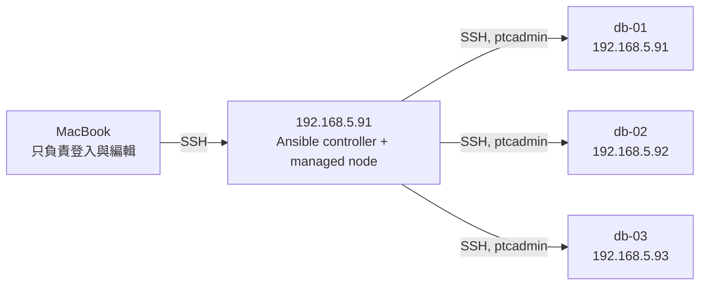

# Ansible 三節點 PROD-like 實戰工作簿

> 適用環境：三台 Ubuntu 26.04 VM，從 `192.168.5.91` 執行 Ansible，管理
> `192.168.5.91`、`192.168.5.92`、`192.168.5.93`。
>
> 這是一份「跟著做、保留犯錯、逐關驗收」的工作簿，不是一鍵部署手冊。
> 每次只完成一個關卡；看到「停止點」就先不要往下跑，把指定輸出交給教練 review。

## 0. 這次練習的定位

這三台是真正的 VM，會操作 SSH、sudo、systemd、套件、磁碟、TLS、VIP 與叢集，
因此比 Docker-in-Docker lab 更接近 production。但是目前仍應稱為
**PROD-like rehearsal（正式環境規格的演練場）**，而不是正式 production：

- 每台只有 2 vCPU、約 7.2 GiB RAM。
- 每台只有一個 49 GiB 的 `/data`，而且是 ext4。
- `vg_data` 已用滿，`VFree=0`，不能直接再切服務專用 LV。
- 沒有可隨時還原的 VM snapshot。
- repo 目前沒有完整的 service teardown playbook。
- 多個資料服務共用三台機器，只能分批演練，不能宣稱是完整平台容量或故障域設計。

我們要同時練兩件事：

1. 會讀寫 Ansible：inventory、變數優先序、module、register、condition、handler、
   check mode、idempotence 與 debug。
2. 會安全部署及維運：明確目標、canary、備份、健康閘門、滾動更新、回復與 teardown。

### 0.1 拓撲



即使 controller 就在第一台，Ansible 仍應透過 SSH 管理 `db-01`。不要把它設為
`ansible_connection: local`，否則「控制端身分」與「受管節點身分」會混在一起，
以後把 controller 搬走時也容易誤執行。

Mac 上已建立的 `~/.ssh/id_ansible_rehearsal3_ed25519` 只用於
**Mac → 192.168.5.91**。不要把 Mac 私鑰複製到 VM；第一台 VM 會建立另一把專用金鑰，
用於 **controller → 三台 VM**。

### 0.2 固定不變的安全規則

1. 所有 Ansible 命令都明寫 `-i inventories/rehearsal3/hosts.yml`。
2. 不直接使用 `inventories/prod`，也不 symlink 其中的 `group_vars`。
3. 現階段不執行 `playbooks/site.yml`、`00-bootstrap.yml` 或
   `05-block-storage.yml`。
4. 第一次變更一律 `--limit db-01 -f 1`，通過驗證後才輪到另外兩台。
5. `--check --diff` 只是預覽，不是 rollback，也不能證明 playbook 一定安全。
6. 每次執行前先看 `--list-hosts`；結果不是預期的三台就停止。
7. 不在 CLI、inventory 或 Git 明文放密碼、vault password、私鑰。
8. 沒有 teardown、資料保留決策與復原方法，就不開始該 DB 叢集。

> 特別注意：本 repo 的 `ansible/ansible.cfg` 目前預設 inventory 是 production，
> 而且全域預設 `become=True`。漏寫 `-i` 不是小錯，可能打到錯誤環境。

## 1. 現有 playbook 是裝在 VM，還是裝在 Docker？

答案是：**混合式，不是全部 Docker，也不是全部原生安裝。**

Docker Engine 本身由 Ansible 以 apt 安裝在 VM；部分服務再由 Docker Compose 跑在
VM 裡。另一部分服務直接由 apt／systemd 跑在 VM 上。

| Playbook | 安裝方式 | 說明 |
|---|---|---|
| `00-bootstrap.yml` | VM 原生 | 改時區、NTP、sysctl、limits、swap、SSH 與基礎套件 |
| `05-block-storage.yml` | VM 原生 | 找裸碟、格式化 XFS、寫入 fstab、掛載；具破壞性 |
| `08-docker.yml` | VM 原生 | 在需要容器的 VM 安裝 Docker Engine |
| `10-pki.yml` | VM 原生 | 在 VM 建 CA、私鑰、憑證與 trust store |
| `20-storage.yml` | VM 原生 | NFS server/client 套件、systemd 與 mount |
| `30-postgres.yml` | VM 原生 | etcd、PostgreSQL/Patroni、PgBouncer、pgBackRest、HAProxy、Keepalived |
| `31-rabbitmq.yml` | VM 原生 | RabbitMQ、HAProxy、Keepalived |
| `32-keydb.yml` | Docker Compose | 每台 VM 跑 KeyDB master、replica 與 exporter 容器 |
| `33-scylladb.yml` | Docker Compose | 每台 VM 跑一個 host-network ScyllaDB 容器 |
| `34-seaweedfs.yml` | 混合 | SeaweedFS 用 Compose；HAProxy/Keepalived 原生安裝在 VM |
| `35-kong.yml` | 混合 | Kong 用 Compose；Keepalived 原生安裝在 VM |
| `40-lb.yml` | VM 原生 | HAProxy、Keepalived |
| `41-egress.yml` | VM 原生 | Squid proxy |
| `50-apps.yml` | Docker Compose | 專案 application stack |
| `60-monitoring.yml` | 混合 | node_exporter 原生；Prometheus/Grafana 等用 Compose |
| `70-gitlab.yml` | 混合 | GitLab CE/Runner 原生；Runner 使用 Docker executor |
| `99-verify.yml` | 不負責安裝 | 執行驗證；部分驗證會建立 extension/table/bucket，不能當成完全唯讀 |

可直接查看：[08-docker.yml](../ansible/playbooks/08-docker.yml)、
[30-postgres.yml](../ansible/playbooks/30-postgres.yml)、
[32-keydb.yml](../ansible/playbooks/32-keydb.yml)、
[33-scylladb.yml](../ansible/playbooks/33-scylladb.yml)、
[34-seaweedfs.yml](../ansible/playbooks/34-seaweedfs.yml)。

## 2. 你提出的「一次跑一組 DB」是否可行？

方向正確，但要把「關閉」拆成三種不同動作：

| 動作 | 意義 | 能否安全切到下一組 |
|---|---|---|
| Stop | 只停 service/container，資料與設定仍在 | 不一定；可能保留 port、VIP、HAProxy/Keepalived 設定或自動重啟 |
| Teardown | 移除服務定義與網路入口，資料依政策保留 | 可以，但必須有已驗證的 teardown runbook |
| Wipe | teardown 後再刪資料 | 可以，但不可逆，必須另外確認 |

三台的固定 node IP `192.168.5.91-93` 可以一直不變，不需要每個叢集重設網路。
但 PostgreSQL、RabbitMQ、SeaweedFS 都會操作同一台 VM 上的 HAProxy 與 Keepalived
設定檔；若只停服務就換 inventory 群組，後一組可能覆蓋前一組設定。

另外，SeaweedFS 在這個 repo 中依賴 PostgreSQL 保存 filer metadata。因此
**SeaweedFS 演練時 PostgreSQL 不能先關閉**。這是「一次只跑一種 DB」的例外。

建議順序如下，但每一組都要先補齊 profile 與 teardown：

1. KeyDB：容器化且沒有 VIP，最適合先練 Compose lifecycle。
2. RabbitMQ：練原生 package/systemd、cluster join 與 quorum queue。
3. PostgreSQL：練 etcd、Patroni、PgBouncer、備份與 failover。
4. ScyllaDB：目前先停止；repo 要求 XFS，而三台 `/data` 都是 ext4。
5. SeaweedFS：最後進行，因為要同時保留 PostgreSQL，且有 VIP 設定衝突。

> 目前不要開始第 1 組。先完成第 3～9 章，確認控制面與實際主機狀態。

## 3. 關卡 0：先建立操作紀錄

在 controller 上執行重大操作前，先記錄 terminal session。不要在記錄期間顯示
vault 內容或把 secret 貼到 terminal。

```bash
mkdir -p /home/ptcadmin/ansible-learning-logs
script -a /home/ptcadmin/ansible-learning-logs/lesson-00-$(date +%F-%H%M).log
```

結束紀錄時輸入：

```bash
exit
```

每個問題用以下格式記在自己的筆記：

```text
命令：
預期：
實際：
狀態：OK / CHANGED / SKIPPED / UNREACHABLE / FAILED
我的假設：
下一個最小驗證：
```

## 4. 關卡 1：打通 Mac → controller

### 4.1 確認 Mac 公鑰

在 Mac 執行：

```bash
ssh-keygen -lf ~/.ssh/id_ansible_rehearsal3_ed25519.pub
ssh-add -l
```

預期兩邊都看見同一個 fingerprint：

```text
SHA256:bqVJPzx8ghZZVL/2YxVY1rLlSWQMKnfjgKewocVzMb8
```

### 4.2 將公鑰放到第一台 VM

先嘗試從 Mac 執行；這一步可能會要求 `ptcadmin` 的登入密碼：

```bash
ssh-copy-id -i ~/.ssh/id_ansible_rehearsal3_ed25519.pub ptcadmin@192.168.5.91
```

若 VM 禁止密碼登入，使用 VM console 的 root session，把下列命令中的
`PASTE_ONE_COMPLETE_PUBLIC_KEY_LINE_HERE` 換成 Mac 上
`cat ~/.ssh/id_ansible_rehearsal3_ed25519.pub` 的完整單行輸出：

```bash
install -d -m 0700 -o ptcadmin -g ptcadmin /home/ptcadmin/.ssh
printf '%s\n' 'PASTE_ONE_COMPLETE_PUBLIC_KEY_LINE_HERE' \
  >> /home/ptcadmin/.ssh/authorized_keys
chown ptcadmin:ptcadmin /home/ptcadmin/.ssh/authorized_keys
chmod 0600 /home/ptcadmin/.ssh/authorized_keys
```

不要貼私鑰；合法公鑰行應以 `ssh-ed25519` 開頭。

### 4.3 驗證

回到 Mac：

```bash
ssh -o BatchMode=yes \
  -o IdentitiesOnly=yes \
  -i ~/.ssh/id_ansible_rehearsal3_ed25519 \
  ptcadmin@192.168.5.91 \
  'hostname; id'
```

判讀：

- `Permission denied (publickey,password)`：公鑰未正確放入、權限錯誤，或 SSHD 不允許該 user。
- `REMOTE HOST IDENTIFICATION HAS CHANGED`：先停，不要直接刪 known_hosts；從 VM console 重新取得 host fingerprint 比對。
- 能看到第一台 hostname 與 `uid=1000(ptcadmin)`：通過。

## 5. 關卡 2：建立 controller → 三台 VM 的專用 SSH 信任

先從 Mac 登入第一台：

```bash
ssh -o IdentitiesOnly=yes \
  -i ~/.ssh/id_ansible_rehearsal3_ed25519 \
  ptcadmin@192.168.5.91
```

以下命令都在 `192.168.5.91`、以 `ptcadmin` 身分執行。

### 5.1 建立新的 controller key

```bash
whoami
hostname -f
umask 077
ssh-keygen -t ed25519 -a 64 \
  -f /home/ptcadmin/.ssh/id_ansible_rehearsal3_controller_ed25519 \
  -C 'ansible-controller@rehearsal3'
ssh-keygen -lf /home/ptcadmin/.ssh/id_ansible_rehearsal3_controller_ed25519.pub
```

私鑰必須留在第一台：

```bash
stat -c '%a %U:%G %n' \
  /home/ptcadmin/.ssh/id_ansible_rehearsal3_controller_ed25519
```

預期 mode 是 `600`，owner 是 `ptcadmin:ptcadmin`。

### 5.2 先驗證 SSH host fingerprint

在每台 VM 的 console 執行以下唯讀命令，記下三個 fingerprint：

```bash
sudo ssh-keygen -lf /etc/ssh/ssh_host_ed25519_key.pub
```

再回到 controller 抓取公開 host key：

```bash
ssh-keyscan -t ed25519 \
  192.168.5.91 192.168.5.92 192.168.5.93 \
  > /tmp/rehearsal3_hostkeys
ssh-keygen -lf /tmp/rehearsal3_hostkeys
```

逐台比對 console 與 `ssh-keyscan` 的 fingerprint。三台全部相符後才執行：

```bash
mkdir -p /home/ptcadmin/.ssh
chmod 0700 /home/ptcadmin/.ssh
cp /tmp/rehearsal3_hostkeys /home/ptcadmin/.ssh/known_hosts
chmod 0600 /home/ptcadmin/.ssh/known_hosts
```

若 `known_hosts` 原本已有其他必要項目，不要覆蓋；先停止並人工合併。不要把
未驗證的 `ssh-keyscan` 結果直接 append，因為那不能防第一次連線的 MITM。

### 5.3 將 controller 公鑰送到三台

```bash
ssh-copy-id \
  -i /home/ptcadmin/.ssh/id_ansible_rehearsal3_controller_ed25519.pub \
  ptcadmin@192.168.5.91

ssh-copy-id \
  -i /home/ptcadmin/.ssh/id_ansible_rehearsal3_controller_ed25519.pub \
  ptcadmin@192.168.5.92

ssh-copy-id \
  -i /home/ptcadmin/.ssh/id_ansible_rehearsal3_controller_ed25519.pub \
  ptcadmin@192.168.5.93
```

### 5.4 從 controller 驗證三台

```bash
for ip in 192.168.5.91 192.168.5.92 192.168.5.93; do
  ssh -o BatchMode=yes \
    -o IdentitiesOnly=yes \
    -i /home/ptcadmin/.ssh/id_ansible_rehearsal3_controller_ed25519 \
    "ptcadmin@$ip" \
    'hostname -f; id'
done
```

預期：三台都不問登入密碼，並顯示 `ptcadmin` 身分。

### 5.5 用真正的 ptcadmin 驗證 sudo

先不要從 root 執行 `sudo -n true`；root 的結果不能代表 `ptcadmin`。

```bash
for ip in 192.168.5.91 192.168.5.92 192.168.5.93; do
  ssh -t \
    -o IdentitiesOnly=yes \
    -i /home/ptcadmin/.ssh/id_ansible_rehearsal3_controller_ed25519 \
    "ptcadmin@$ip" \
    'sudo -k; sudo id'
done
```

目前第一台的 sudo 規則是 `(ALL : ALL) ALL`，不是 NOPASSWD，要求密碼是正常的。
後續 Ansible 使用大寫 `-K`（`--ask-become-pass`）。小寫 `-k` 是 SSH 密碼，兩者不同。

若三台的 `ptcadmin` sudo 密碼不同，單次 `-K` 無法替每台輸入不同密碼。此時先逐台
`--limit` 執行，或另外設計 vault／受稽核的 NOPASSWD 規則；不要把三組密碼寫進 inventory。

再逐台檢查 sudoers 語法：

```bash
for ip in 192.168.5.91 192.168.5.92 192.168.5.93; do
  ssh -t \
    -o IdentitiesOnly=yes \
    -i /home/ptcadmin/.ssh/id_ansible_rehearsal3_controller_ed25519 \
    "ptcadmin@$ip" \
    'sudo -k; sudo visudo -c'
done
```

第一台先前的 `/etc/sudoers.d/ad-admins` 內容是 shell 命令
`sudo chmod 0440 /etc/sudoers.d/ad-admins`，不是 sudoers 規則。它應繼續隔離在
`/root/ad-admins.invalid-20260814`，不要移回 `/etc/sudoers.d/`。三台都必須看到
`parsed OK` 才能繼續。

### 停止點 A

先交回以下輸出，不要貼任何 public key 全文或密碼：

```text
1. controller 上專用 key 的 fingerprint
2. 三台 SSH host key fingerprint
3. 三台 hostname -f 與 id 的結果
4. 三台 sudo id 是成功、要求密碼、還是失敗
```

## 6. 關卡 3：在第一台建立 Ansible 工具鏈

仍在 `192.168.5.91`，以 `ptcadmin` 執行：

```bash
sudo apt-get update
sudo apt-get install -y git make python3-venv

python3 -m venv /home/ptcadmin/venvs/ansible
source /home/ptcadmin/venvs/ansible/bin/activate
python -m pip install --upgrade pip
python -m pip install \
  'ansible-core==2.21.2' \
  ansible-lint \
  yamllint

ansible --version
ansible-playbook --version
ansible-lint --version
```

這裡先讓 controller 與已知的 Mac 版本都使用 `ansible-core 2.21.2`。未來升版要用 PR、
CI 與測試完成，不在部署當天臨時升版。

每次重新登入 controller 都要先：

```bash
source /home/ptcadmin/venvs/ansible/bin/activate
```

若 `ansible --version` 顯示 `/usr/bin/ansible`，代表 venv 沒啟用。用以下命令確認：

```bash
type -a ansible
python -c 'import sys; print(sys.executable)'
```

## 7. 關卡 4：取得 repo，安裝 collections

### 7.1 Clone

在 controller 執行：

```bash
cd /home/ptcadmin
git clone https://github.com/JustinHsu0320/onpremis_gitops.git
cd /home/ptcadmin/onpremis_gitops
git status --short
git remote -v
```

目前 repo 可透過 HTTPS 唯讀 clone，因此這一步不需要把 GitHub 私鑰放上 controller。
未來若 controller 要 push，另建 GitHub 專用、最小權限的 deploy key；不要重用
Ansible controller 私鑰。

### 7.2 安裝 repo collections

fresh clone 不包含 `ansible/collections`；只安裝 `ansible-core` 還不夠。

```bash
cd /home/ptcadmin/onpremis_gitops
source /home/ptcadmin/venvs/ansible/bin/activate
make deps BIN=/home/ptcadmin/venvs/ansible/bin/

cd /home/ptcadmin/onpremis_gitops/ansible
ansible-galaxy collection list
```

至少應看見：

```text
community.docker
community.crypto
ansible.posix
community.general
community.postgresql
community.rabbitmq
```

目前 `requirements.yml` 使用最低版本範圍而非 exact pin，因此不同日期重新安裝可能拿到
不同 collection 版本。正式環境應再產生並驗證鎖定版本；本關先記錄實際版本。

### 7.3 看懂實際載入的設定

必須從 `ansible/` 目錄執行，才會載入專案的 `ansible.cfg`：

```bash
cd /home/ptcadmin/onpremis_gitops/ansible
ansible --version
ansible-config dump --only-changed
```

檢查 `config file` 是否為：

```text
/home/ptcadmin/onpremis_gitops/ansible/ansible.cfg
```

並找出這三個設定：

```bash
ansible-config dump --only-changed \
  | grep -E 'DEFAULT_HOST_LIST|DEFAULT_BECOME|HOST_KEY_CHECKING'
```

練習題：說明為什麼本工作簿之後每一條命令都要明寫 `-i`。

## 8. 關卡 5：親手建立最小、安全的 inventory

不要複製 `inventories/prod`，因為其中的 IP、VIP、磁碟容量、服務群組、vault 與主機角色
都不是這三台的事實。

### 8.1 建目錄並用 editor 輸入

```bash
cd /home/ptcadmin/onpremis_gitops/ansible
mkdir -p inventories/rehearsal3
nano inventories/rehearsal3/hosts.yml
```

親手輸入以下最小版本：

```yaml
---
all:
  vars:
    ansible_user: ptcadmin
    ansible_connection: ssh
    ansible_python_interpreter: /usr/bin/python3
    ansible_ssh_private_key_file: /home/ptcadmin/.ssh/id_ansible_rehearsal3_controller_ed25519
    is_container: false
    use_egress_proxy: false
    storage_volumes: []

  children:
    rehearsal_nodes:
      hosts:
        db-01:
          ansible_host: 192.168.5.91
        db-02:
          ansible_host: 192.168.5.92
        db-03:
          ansible_host: 192.168.5.93
```

設計理由：

- 一個 IP 只有一個 inventory hostname；之後同一個 `db-01` 加入不同 service group，
  不另外創造 `pg-01`、`mq-01` 等指向相同 IP 的假身分。
- `db-01` 也走 SSH，不使用 `local`。
- inventory 不把 become 固定為 true；read-only play 使用 `become: false`，真正需要 root
  的 play 才明寫 `become: true`。這樣比依賴專案 cfg 的全域預設更容易 review。
- `storage_volumes: []` 明確禁止現有 block storage role 找碟格式化。
- inventory 沒有密碼與 secret。

### 8.2 只解析，不連線

```bash
ansible-inventory \
  -i inventories/rehearsal3/hosts.yml \
  --graph

ansible-inventory \
  -i inventories/rehearsal3/hosts.yml \
  --host db-01

ansible \
  -i inventories/rehearsal3/hosts.yml \
  rehearsal_nodes \
  --list-hosts
```

預期 graph 只有 `db-01`、`db-02`、`db-03`。若出現 prod host，立刻停止。

### 8.3 檢查重複 IP

```bash
ansible-inventory \
  -i inventories/rehearsal3/hosts.yml \
  --list \
  | python3 -c '
import json, sys
d = json.load(sys.stdin)
hosts = d.get("_meta", {}).get("hostvars", {})
seen = {}
for name, var in hosts.items():
    ip = var.get("ansible_host", name)
    seen.setdefault(ip, []).append(name)
bad = {ip: names for ip, names in seen.items() if len(names) > 1}
print(bad)
raise SystemExit(bool(bad))
'
```

預期輸出 `{}`，exit code 是 0。

## 9. 關卡 6：先用 ad-hoc command 學會判讀

### 9.1 Ansible ping

```bash
ansible \
  -i inventories/rehearsal3/hosts.yml \
  rehearsal_nodes \
  -m ansible.builtin.ping \
  -e ansible_become=false \
  -f 1
```

`ansible.builtin.ping` 不是 ICMP ping。它驗證 inventory、SSH、遠端 Python、module
傳輸與 JSON 回應。成功會看到 `pong`。

若失敗，先只測一台並加 verbose：

```bash
ansible \
  -i inventories/rehearsal3/hosts.yml \
  db-01 \
  -m ansible.builtin.ping \
  -e ansible_become=false \
  -vvv
```

這裡明寫 `-e ansible_become=false`，是因為現有專案 `ansible.cfg` 把 become 的全域預設設為
true；本關只要驗 SSH 與 Python，不應順便要求 sudo。

### 9.2 收集 facts

```bash
ansible \
  -i inventories/rehearsal3/hosts.yml \
  rehearsal_nodes \
  -m ansible.builtin.setup \
  -a 'filter=ansible_distribution*' \
  -e ansible_become=false \
  -f 1

ansible \
  -i inventories/rehearsal3/hosts.yml \
  rehearsal_nodes \
  -m ansible.builtin.setup \
  -a 'filter=ansible_memtotal_mb' \
  -e ansible_become=false \
  -f 1
```

### 9.3 驗證 become

因為 `ptcadmin` 目前需要 sudo password，使用大寫 `-K`：

```bash
ansible \
  -i inventories/rehearsal3/hosts.yml \
  db-01 \
  -b -K \
  -m ansible.builtin.command \
  -a 'id'
```

先逐台執行：

```bash
ansible -i inventories/rehearsal3/hosts.yml db-02 -b -K -m ansible.builtin.command -a 'id'
ansible -i inventories/rehearsal3/hosts.yml db-03 -b -K -m ansible.builtin.command -a 'id'
```

預期遠端 command 顯示 `uid=0(root)`。這些 ad-hoc `command` 可能顯示 `CHANGED`，
因為 Ansible 不知道 `id` 是唯讀；下一章會用 `changed_when: false` 修正語意。

### 9.4 唯讀盤點 Docker 與磁碟

三台已出現 `docker0`，但 interface 存在不等於 Docker 一定健康：

```bash
ansible \
  -i inventories/rehearsal3/hosts.yml \
  rehearsal_nodes \
  -b -K -f 1 \
  -m ansible.builtin.shell \
  -a 'docker --version 2>&1; systemctl is-active docker 2>&1; findmnt /data; lsblk -e7 -o NAME,TYPE,SIZE,FSTYPE,MOUNTPOINTS,PKNAME'
```

這裡使用 `shell` 是因為有 `;` 與 `2>&1`；一般情況優先使用 `command`。本命令只盤點，
不安裝也不啟動 Docker。

### 停止點 B

交回：

```text
1. inventory --graph
2. 三台 ansible ping 結果
3. 三台 distribution/version、memory facts
4. 三台 become id 結果
5. 三台 docker/version、service state、findmnt /data 結果
```

### 停止點 B 實作紀錄（2026-08-28）

本次 rehearsal 已完成停止點 B 的控制面與主機盤點，三台結果一致：

- `db-01`、`db-02`、`db-03` 的 `ansible.builtin.setup` 成功，OS 是 Ubuntu 26.04（`resolute`），記憶體為 7376 MiB。
- Ansible become 已通過，三台都能回傳 `uid=0(root)`；因 Ubuntu 26.04 的 `/usr/bin/sudo` 目前是 `sudo-rs`，rehearsal inventory 使用 `/usr/bin/sudo.ws` 作為 `ansible_become_exe`，不改 system alternatives，也不把 sudo 密碼寫入 inventory。
- 三台 Docker 都是 `29.7.2`，systemd 狀態為 `active`。
- 三台 `/data` 都是 `/dev/mapper/vg_data-lv_data` 上的 `ext4`，以 `rw,relatime` 掛載；`sdb` 是既有 50G LVM data disk，不是可交給 `05-block-storage.yml` 格式化的裸碟。
- 本次 Docker/磁碟指令是唯讀盤點；ad-hoc `shell` 顯示 `CHANGED` 只代表 module 的狀態語意，不能解讀成已修改主機。

本紀錄不代表已完成任何資料服務部署，也不代表已驗證 XFS、備份、teardown、還原或 production 容量。依第 13 章規則，現階段仍禁止執行 `05-block-storage.yml`；下一關進入唯讀 `playbooks/rehearsal/00-preflight.yml`，先做 syntax check、`--list-hosts`、canary 與 check mode。

## 10. 關卡 7：寫第一支「唯讀 preflight」playbook

### 10.1 建立檔案

```bash
cd /home/ptcadmin/onpremis_gitops/ansible
mkdir -p playbooks/rehearsal
nano playbooks/rehearsal/00-preflight.yml
```

親手輸入：

```yaml
---
- name: Rehearsal3 read-only preflight
  hosts: rehearsal_nodes
  gather_facts: true
  become: false

  tasks:
    - name: Assert the agreed VM baseline
      ansible.builtin.assert:
        that:
          - ansible_distribution == 'Ubuntu'
          - ansible_distribution_version == '26.04'
          - ansible_architecture == 'x86_64'
          - ansible_memtotal_mb | int >= 7000
        fail_msg: >-
          {{ inventory_hostname }} does not match the agreed Ubuntu 26.04,
          x86_64, 7 GiB minimum baseline.

    - name: Inspect the existing data mount
      ansible.builtin.command:
        argv:
          - findmnt
          - --noheadings
          - --output
          - SOURCE,FSTYPE,OPTIONS
          - /data
      register: rehearsal_data_mount
      changed_when: false
      check_mode: false

    - name: Show the data mount for human review
      ansible.builtin.debug:
        msg: >-
          {{ inventory_hostname }} /data = {{ rehearsal_data_mount.stdout }}
```

### 10.2 先做靜態檢查

```bash
ansible-playbook \
  -i inventories/rehearsal3/hosts.yml \
  --syntax-check \
  playbooks/rehearsal/00-preflight.yml

ansible-playbook \
  -i inventories/rehearsal3/hosts.yml \
  --list-hosts \
  playbooks/rehearsal/00-preflight.yml

ansible-playbook \
  -i inventories/rehearsal3/hosts.yml \
  --list-tasks \
  playbooks/rehearsal/00-preflight.yml
```

先確認 `--list-hosts` 只有三台。

### 10.3 canary，再跑全組

```bash
ansible-playbook \
  -i inventories/rehearsal3/hosts.yml \
  playbooks/rehearsal/00-preflight.yml \
  --limit db-01 \
  -f 1

ansible-playbook \
  -i inventories/rehearsal3/hosts.yml \
  playbooks/rehearsal/00-preflight.yml \
  -f 1
```

預期 `changed=0`。若唯讀 playbook 出現 `changed>0`，先找是哪個 task 的狀態語意沒有
正確表達。

### 10.4 check mode

```bash
ansible-playbook \
  -i inventories/rehearsal3/hosts.yml \
  playbooks/rehearsal/00-preflight.yml \
  --check --diff \
  -f 1
```

`findmnt` 是唯讀 probe，所以明寫 `check_mode: false`，讓它在 check mode 仍實際執行；
同時用 `changed_when: false` 告訴 Ansible 它不會改狀態。這兩行是不同概念。

## 11. 關卡 8：安全的故意犯錯練習

一次只做一題，觀察錯誤，寫下假設，再復原檔案。

### 11.1 Host pattern 打錯

把 playbook 的 `hosts: rehearsal_nodes` 暫時改成：

```yaml
hosts: rehearsal_node
```

執行 `--list-hosts`，應看到 no hosts matched 或空清單。使用以下命令找正確 group：

```bash
ansible-inventory -i inventories/rehearsal3/hosts.yml --graph
```

復原成 `rehearsal_nodes`。

### 11.2 變數名稱打錯

把 `ansible_distribution_version` 暫時拼錯，執行 canary。觀察 undefined variable 的
task 名稱與訊息，再用以下命令確認 facts：

```bash
ansible \
  -i inventories/rehearsal3/hosts.yml \
  db-01 \
  -m ansible.builtin.setup \
  -a 'filter=ansible_distribution*' \
  -e ansible_become=false
```

復原變數名稱。

### 11.3 移除 changed_when

暫時刪除 `changed_when: false`，重跑 playbook。`findmnt` task 會顯示 changed，雖然主機
其實沒被修改。這說明「changed」是 module/playbook 對狀態的判斷，不是 terminal 顏色
自動證明。完成後把該行加回。

### 11.4 故意製造 YAML indentation error

只在這支 rehearsal playbook 中，把一個 task 多縮排一格，先跑 `--syntax-check`，不要
直接執行。記錄錯誤行號後復原。

### 停止點 C

交回正常版本的：

```text
1. --syntax-check 結果
2. canary PLAY RECAP
3. 全三台 PLAY RECAP
4. --check --diff 的 PLAY RECAP
5. 四個故意犯錯各自看見的錯誤與你的判斷
```

## 12. Debug 階梯：從最便宜的證據開始

遇到錯誤時，依序做，不要一開始就重跑整個 `site.yml`。

### 12.1 確認目前目錄與設定

```bash
pwd
ansible --version
ansible-config dump --only-changed
```

### 12.2 確認 inventory 解析結果

```bash
ansible-inventory -i inventories/rehearsal3/hosts.yml --graph
ansible-inventory -i inventories/rehearsal3/hosts.yml --host db-01
```

### 12.3 確認 raw SSH

```bash
ssh -vv \
  -o IdentitiesOnly=yes \
  -i /home/ptcadmin/.ssh/id_ansible_rehearsal3_controller_ed25519 \
  ptcadmin@192.168.5.91 \
  'python3 --version; id'
```

### 12.4 縮小到單一 host、單一 module

```bash
ansible \
  -i inventories/rehearsal3/hosts.yml \
  db-01 \
  -m ansible.builtin.ping \
  -e ansible_become=false \
  -vvv
```

### 12.5 先列目標與 tasks

```bash
ansible-playbook -i inventories/rehearsal3/hosts.yml PLAYBOOK.yml --list-hosts
ansible-playbook -i inventories/rehearsal3/hosts.yml PLAYBOOK.yml --list-tasks
ansible-playbook -i inventories/rehearsal3/hosts.yml PLAYBOOK.yml --syntax-check
```

### 12.6 常見錯誤對照

| 症狀 | 第一個檢查 | 不要先做什麼 |
|---|---|---|
| `UNREACHABLE` | raw SSH、key、host fingerprint、route/VPN | 不要關 host key checking |
| `Missing sudo password` | 加 `-K`，確認 `sudo -l` | 不要把密碼明文放 inventory |
| `MODULE FAILURE` | 遠端 Python、`-vvv` stderr | 不要直接重灌 VM |
| `collection ... not found` | `make deps`、collection path | 不要隨機全域 pip install |
| undefined variable | `ansible-inventory --host`、變數拼字 | 不要用空字串掩蓋 |
| no hosts matched | `--graph`、group 名稱 | 不要改成 `hosts: all` 碰運氣 |
| 每次都 `changed` | module 是否冪等、`changed_when` | 不要把它當作正常成功 |
| handler 一次重啟全叢集 | play/role 的 notify、serial、limit | 不要在三台同時重跑 |

### 12.7 PLAY RECAP 怎麼讀

- `ok`：task 成功且沒有宣告狀態變更。
- `changed`：Ansible 認為狀態被改動；第二次執行通常應回到 0。
- `skipped`：條件不符合；要確認是有意跳過，不是變數錯誤。
- `unreachable`：控制端連不到受管節點，task 還沒有真正開始。
- `failed`：已連到節點，但 module、assert、command 或條件失敗。
- `rescued/ignored`：錯誤被流程接住；不能只看整體 exit code 就當作健康。

## 13. 儲存現況與禁止事項

三台目前都是：

```text
/dev/sdb1 -> vg_data -> lv_data -> ext4 -> /data
VG free extents = 0
```

因此：

1. `05-block-storage.yml` 不會「自動採用既有 `/data`」。它期待整顆未使用裸碟，並會
   建 XFS；目前不得執行。
2. 只設定 `storage_volumes: []` 能防止格式化，但不會自動讓服務資料落到 `/data`。
3. PostgreSQL 預設資料在 `/var/lib/postgresql/...`、RabbitMQ 在
   `/var/lib/rabbitmq`、KeyDB 在 `/opt/keydb`、ScyllaDB 在 `/var/lib/scylla`、
   SeaweedFS 在 `/var/lib/seaweedfs`。若未另做 mount，會落在 28 GiB root filesystem。
4. `/data` 是 ext4；repo 的 Scylla 設計要求 XFS，不能把這次結果宣稱為 production
   equivalent。
5. 不要在沒有可驗證備份時做 `lvreduce`、重建 filesystem 或重分割。即使 ext4 可離線
   縮小，這也不是目前教學要承擔的風險。

後續較小風險的方案是先設計 persistent bind mounts，例如
`/data/rehearsal3/<service>` → 服務的 canonical path；但要先完成：

- 原目標目錄是否有資料的 assert。
- owner/mode、fstab、mount dependency 與開機測試。
- 外部備份與 restore 演練。
- teardown 時保留、封存或刪除資料的明確選項。
- root 與 `/data` 的容量告警。

這些會是下一份「storage profile」練習，不在本關直接代做。

## 14. 進入第一個 DB 叢集前的變更閘門

完成停止點 A～C 後，才為 KeyDB 建第一個 profile。每個 DB profile 必須同時包含四份
可讀、可 review 的內容：

1. `inventory/group_vars`：同一組 `db-01..03` 加入服務群組，不建立重複 IP 身分。
2. `deploy playbook`：canary／bootstrap／join／health gate 的順序。
3. `verify playbook`：正常、單節點故障、恢復後的驗證。
4. `teardown playbook`：stop、remove、retain-data、wipe-data 的界線。

每次 mutation 的固定節奏：

```text
inventory graph
  → resolved vars
  → syntax check
  → list-hosts/list-tasks
  → check/diff（若 role 支援）
  → canary -f 1
  → health gate
  → 下一台
  → 全叢集 verify
  → teardown rehearsal
  → restore/resume rehearsal
```

### 14.1 目前 repo 的已知阻擋點

在開始 DB 前要一項項處理：

- 現有 role 沒有完整 teardown；不能用 `docker stop` 或 `systemctl stop` 冒充 rollback。
- stateful playbook 並非所有階段都把安全 rolling order 寫進程式，不能只靠操作者記得
  `--limit`。
- PKI 強制輪替後，服務 reload 必須與憑證變更在可追蹤的同一流程完成。
- `99-verify.yml` 並非完全唯讀，也不適合在故意停掉 inventory host 時期待全綠。
- 現有完整 `site.yml --check` 並非每個 role 都可靠；check mode 不是安全證明。
- PostgreSQL 的 pgBackRest 依賴 NFS 設計；role 已配置每日 full/diff、zstd 壓縮與
  7 天 time retention，但不能跳過 storage 就宣稱備份完成。跳過 NFS 時只能驗證
  本機備份機制，不能宣稱具備異地 DR 能力。
- ScyllaDB 目前被 ext4 與資源規格阻擋。
- SeaweedFS 需要 PostgreSQL 同時存在，並與其他資料 profile 共用 HAProxy/Keepalived 路徑。

## 15. 第一輪請做到哪裡？

第一次實作只做到「停止點 A」：

1. 打通 Mac → controller。
2. 建 controller 專用 SSH key，打通 controller → 三台。
3. 驗證三台 `ptcadmin` 的 sudo 行為。
4. 驗證三台 SSH host fingerprint 與 sudoers 語法。

把停止點 A 的輸出貼回來後，再一起 review；有錯誤時先分析原因，不跳過、不一次幫你
把所有設定寫完。確認 SSH 與 sudo 控制面乾淨後，下一輪才安裝 Ansible、建立 inventory，
並做到停止點 B。

## 附錄 A：每次執行前的口訣

```text
我在哪個 controller？
我載入哪個 ansible.cfg？
我明寫哪個 inventory？
這個 pattern 最後解析成哪些 hosts？
這個 task 是 read、change、restart、format 還是 delete？
失敗時能否從 console 恢復？
資料要保留、封存，還是刪除？
```

## 附錄 B：不要直接複製的危險命令

現階段以下命令只供辨識，**不要執行**：

```bash
# 漏寫 -i，可能套用 repo 預設 production inventory
ansible-playbook playbooks/site.yml

# 會碰 SSH hardening、swap、sysctl 等系統基線
ansible-playbook -i inventories/rehearsal3/hosts.yml playbooks/00-bootstrap.yml

# 會找裸碟並建立 filesystem；不是「把現有 /data 登記進 Ansible」
ansible-playbook -i inventories/rehearsal3/hosts.yml playbooks/05-block-storage.yml

# force PKI 不是一般 smoke test
ansible-playbook -i inventories/rehearsal3/hosts.yml playbooks/10-pki.yml -e force=true
```
