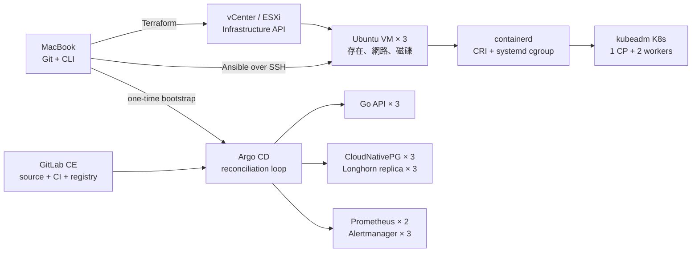

# MacBook → VMware → Ubuntu → Terraform → Ansible → containerd → 3-node K8s → Go API

> 給已經懂 Go、Docker、Kubernetes 與 Terraform 基礎的後端工程師。這不是「把 CLI
> 裝起來」的清單，而是一條可以重建、可以審查、可以回復、最後由 Git 持續校正的
> on-prem platform delivery chain。

---

## 先講結論：每一層只擁有一種狀態



| Layer | Owner | 寫什麼 | 不該做什麼 |
|---|---|---|---|
| L0 控制站 | MacBook | Git、Terraform/Ansible/kubectl/Helm CLI | 在 Mac 裝 kubelet/containerd |
| L1 VM | Terraform | CPU、RAM、VMDK、NIC、IP、cloud-init handoff | 用 provisioner 長期設定 OS |
| L2 OS | Ansible | 核心參數、套件、containerd、kubeadm | 建 vSphere VM、部署業務 App |
| L3 叢集 | kubeadm + Cilium | API Server、etcd、kubelet、Pod 網路 | 把 GitOps 物件寫進映像檔 |
| L4 平台與 App | Argo CD | Longhorn、CNPG、監控、Go API | CI 直接 `kubectl apply` |
| L5 變更管線 | GitLab CI | test、build、push、更新 image tag | 持有 cluster-admin kubeconfig |

把責任切乾淨之後，除錯問題會變成很明確的五句話：VM 存在嗎？SSH 可達嗎？
Node Ready 嗎？Argo Sync 嗎？SLO 正常嗎？

---

## 0. VMware 的相容性邊界：先別把 Fusion 和 vSphere 混在一起

這份 Lab 提供兩條入口，但只有第一條是完整 IaC 路徑。

### 路徑 A：完整路徑（推薦）

```text
MacBook（CLI） ── HTTPS/443 ──> vCenter / ESXi cluster
                                      │
                           Terraform clone template
                                      │
                            Ubuntu VM × 3 on vSphere
```

- VMware 安裝在伺服器端：ESXi hosts + vCenter；Mac 只用瀏覽器開 vSphere Client。
- Terraform、Ansible、kubectl、Helm 全部安裝在 Mac。
- 官方 `vmware/vsphere` provider 透過 vSphere API 建 VM。
- Ubuntu template 需要 `cloud-init`、`open-vm-tools` 與 SSH public key handoff。

### 路徑 B：單機預覽（VMware Fusion）

```text
MacBook
├── VMware Fusion
│   ├── Ubuntu k8s-cp-01
│   ├── Ubuntu k8s-worker-01
│   └── Ubuntu k8s-worker-02
└── Terraform / Ansible / kubectl / Helm CLI
```

- VMware Fusion 安裝在 Mac。
- Fusion 不是 vCenter；官方 vSphere provider 不會把它當成 vSphere endpoint。
- 手動 clone 三台 Ubuntu、設定本文件的固定 IP，複製
  `ansible/inventory/hosts.example.yml` 成 `generated.yml`，從 Ansible 開始。
- Apple Silicon 請使用 ARM64 Ubuntu guest；映像建置保留 `linux/amd64,linux/arm64`。
- 不建議為了這個 Lab 在 Apple Silicon 上硬套 nested ESXi；那會讓你在學平台之前，
  先把時間花在虛擬化相容性問題。

HashiCorp 的官方 vSphere 教學本來就把「既有 vSphere environment」列為前置條件；
provider 邊界可參考 [Manage VMs on vSphere](https://developer.hashicorp.com/terraform/tutorials/virtual-machine/vsphere-provider)。

---

## 1. 預算與拓撲：先選 profile

| Profile | Mac RAM | VM 配置 | 能跑什麼 |
|---|---:|---|---|
| Core | 16 GB | CP 4 GB、Worker 各 6 GB | kubeadm、Cilium、MetalLB、Argo CD、Go API |
| Full | 32 GB 以上 | 每台 4 vCPU / 8 GB，100–120 GB disk | Core + Longhorn + CNPG 3 instance + HA monitoring |

Full profile 的 IP 規劃：

| 名稱 | 角色 | IP | 主要責任 |
|---|---|---:|---|
| `k8s-cp-01` | control-plane + lab workload | `192.168.68.211` | API Server、etcd、scheduler、第三份 workload |
| `k8s-worker-01` | worker | `192.168.68.212` | application / storage replica |
| `k8s-worker-02` | worker | `192.168.68.213` | application / storage replica |
| MetalLB pool | north-south VIP | `.240–.250` | Gateway / service LoadBalancer |

在家用路由器把 `.211–.213` 與 `.240–.250` 排除於 DHCP 範圍。三台 VM 之間需完整互通，
Mac 至少要能連 22/TCP 與 6443/TCP。Lab 預設停用 UFW 是為了縮短第一輪 bootstrap；
正式環境應改成明確的 [Kubernetes ports and protocols](https://kubernetes.io/docs/reference/networking/ports-and-protocols/) 防火牆矩陣。

---

## 2. 哪裡安裝什麼

| 元件 | Mac | Ubuntu VM | K8s cluster |
|---|:---:|:---:|:---:|
| VMware Fusion（桌面模式） | ✓ |  |  |
| vCenter / ESXi（完整模式） | 瀏覽器操作 | 伺服器端 |  |
| Git / Terraform / Ansible | ✓ |  |  |
| kubectl / Helm / argocd / cilium CLI | ✓ |  |  |
| cloud-init / open-vm-tools |  | template 內 |  |
| containerd / kubelet / kubeadm |  | ✓ |  |
| Cilium / MetalLB / Argo CD |  |  | ✓ |
| Longhorn / CloudNativePG / Prometheus / Grafana |  |  | ✓ |
| Go API image | build on CI | containerd pulls | Deployment × 3 |

Mac CLI（Homebrew）：

```bash
brew tap hashicorp/tap
brew install hashicorp/tap/terraform ansible kubernetes-cli helm argocd cilium-cli kustomize kubeconform
make doctor
```

不要在 K8s node 安裝 Docker Engine。Kubernetes 透過 CRI 使用 containerd；CI build 則交給
BuildKit。這是「執行容器」與「建置映像」兩種責任。Kubernetes 官方也要求 runtime 與
kubelet 的 cgroup driver 一致；Ubuntu/systemd 路線應使用 `systemd` driver，參考
[Container runtimes](https://kubernetes.io/docs/setup/production-environment/container-runtimes/)。

---

## 3. 目錄就是交付流程

```text
labs/mac-vmware-k8s-gitops/
├── LAB-GUIDE.md                  # 你正在讀的完整教程
├── Makefile                      # 人類操作入口
├── terraform/                    # L1：vSphere VM 與 inventory contract
├── ansible/                      # L2/L3：Ubuntu、containerd、kubeadm
├── apps/go-api/                  # 業務程式與 distroless image
├── k8s/
│   ├── platform/                 # bootstrap values：Cilium/MetalLB/Argo/監控
│   ├── apps/go-api/              # 3 replicas + PDB + HPA + Gateway + policy
│   └── data/postgres/            # CNPG 3 instances + PgBouncer
├── gitops/
│   ├── bootstrap/root-app.yaml   # 唯一一次手動 apply
│   └── apps/                     # App-of-Apps 第二層
├── .gitlab-ci.yml                # test → BuildKit → bump GitOps tag
└── site/                         # 互動動畫教學
```

既有 repo 的 `terraform/modules/vm` 被 Lab 直接重用：cloud-init 透過 VMware guestinfo
注入、網路用靜態 IP、template 只負責第一次交棒。這不是另外寫一套「教學玩具」，而是
把現有 production module 收斂成三台節點。

---

## 4. Day 0：準備 Ubuntu template

Template 是最容易被忽略的 API contract。它必須滿足：

- Ubuntu Server 24.04 LTS 或已驗證的企業基線版本。
- 已安裝 `cloud-init` 與 `open-vm-tools`，並啟用 VMware guestinfo datasource。
- OS disk 不大於 Lab 的 `disk_gb`，因為 clone 可放大、不能縮小。
- 開機後可透過 cloud-init 建立 `ansible` 使用者與 SSH key。
- NIC 使用 VMXNET3；時鐘、DNS、NTP 可正常工作。

可用 Packer 產 template；Terraform 官方教學也採用 Packer → template → clone 的分工。
Template 更新應有新名稱，例如 `ubuntu-24.04-202608`，不要在原 template 上偷偷修改。

驗收：clone 一台暫存 VM，確認 `cloud-init status --wait`、`vmtoolsd -v` 與 SSH 後再轉成
template。Template 沒驗證，Terraform 一次 clone 三台只會把同一個錯誤放大三倍。

---

## 5. Day 1：Terraform 建三台 VM

準備輸入：

```bash
cd labs/mac-vmware-k8s-gitops
cp terraform/terraform.tfvars.example terraform/terraform.tfvars
export TF_VAR_vsphere_password='replace-me'
make tf-init
make tf-plan
make tf-apply
```

要 review 的關鍵不是 HCL 語法，而是四個 contract：

1. `nodes` map 是 hostname、role、IP、CPU、RAM、disk 的單一來源。
2. `module.k8s_node` 重用根目錄的 production VM module。
3. `ssh_public_key_path` 只讀公鑰；password 由環境變數進 process，不進 Git。
4. `local_file.ansible_inventory` 把 Terraform output 變成下一層的 inventory。

```hcl
module "k8s_node" {
  for_each = var.nodes
  source   = "../../../terraform/modules/vm"

  name       = each.key
  cpu        = each.value.cpu
  memory_mb  = each.value.memory_mb
  os_disk_gb = each.value.disk_gb
  networks = [{
    port_group = var.network
    ipv4       = each.value.ip
    netmask    = var.netmask
    gateway    = var.gateway
  }]
}
```

成功條件：`terraform output node_ips` 正確、三台 VM VMware Tools 為 running、
`ansible/inventory/generated.yml` 已產生、`ssh ansible@192.168.68.211` 可達。

### State 最佳實踐

Lab 可先用 local state，但多人協作要搬到 GitLab-managed Terraform state 或有鎖的 remote
backend。CI 只在 MR 做 `fmt/validate/plan`；`apply` 綁 protected branch、protected environment
與人工核准。State、plan artifact 與 provider credential 都視為敏感資料。

---

## 6. Day 2：Ansible 把「三台 Ubuntu」變成「三個 K8s node」

```bash
make ansible-check
make ansible-apply
```

Playbook 順序刻意固定：

```text
baseline → containerd → kube packages → control-plane → workers → fetch kubeconfig
```

關鍵設置：

- 關 swap，且從 `/etc/fstab` 永久移除。
- 載入 `overlay`、`br_netfilter`，打開 bridge iptables 與 IPv4 forward。
- containerd 使用 `overlayfs`、CRI 啟用、`SystemdCgroup = true`。
- kubelet、kubeadm、kubectl 來自同一個 `pkgs.k8s.io` minor repository，安裝後 hold。
- `kubeadm init` 用 `creates: /etc/kubernetes/admin.conf` 保持可重跑。
- worker join token 只存在本次 Ansible 執行記憶體，`no_log: true`，30 分鐘失效。
- kubeconfig 回傳到 `artifacts/` 並以 `0600` 保存；該目錄已被 Git 忽略。

```toml
[plugins."io.containerd.grpc.v1.cri".containerd.runtimes.runc.options]
  SystemdCgroup = true
```

```yaml
apiVersion: kubelet.config.k8s.io/v1beta1
kind: KubeletConfiguration
cgroupDriver: systemd
```

這兩段必須成對。cgroup 不一致常見症狀不是「立刻報一個漂亮錯誤」，而是 kubelet 反覆
重啟、Pod sandbox 建立失敗，或節點在壓力下變得不穩。

> 本 Lab 預設把 control-plane taint 移除，讓三副本真的能分散到三台 VM。這是 laptop
> 資源折衷，不是 production HA control plane。正式叢集應是 3 control-plane + N workers，
> API endpoint 再由 kube-vip 或外部 HAProxy/Keepalived 提供。

---

## 7. Day 3：先讓叢集能通，再交給 GitOps

```bash
make platform-bootstrap
make kube-status
```

Bootstrap 順序：

1. Gateway API CRDs：先讓 Kubernetes 認得 `Gateway` / `HTTPRoute`。
2. Cilium：Pod 網路、NetworkPolicy、Hubble、Gateway controller。
3. MetalLB：把家用/實驗室 LAN 的一段 IP 交給 `LoadBalancer` Service。
4. Argo CD：安裝 reconciliation engine；server/repo-server 各 2 replicas。

為何 Cilium 沒立刻取代 kube-proxy？第一輪 Lab 優先可回復性。Cilium 先只當 CNI 與
Gateway controller，等你完成整條鏈並有 Hubble 觀測後，再依官方
[kube-proxy replacement](https://docs.cilium.io/en/stable/network/kubernetes/kubeproxy-free/)
實驗。一次改掉網路與 Service data path，出錯時很難分層。

MetalLB 的 `.240–.250` 必須先在路由器保留。若你的 LAN 不是 `192.168.68.0/24`，先改
`k8s/platform/metallb-pool.yaml`；IP pool 選錯會造成 LAN 上的 ARP 衝突。

---

## 8. Day 4：Go API 不是一個 Pod，而是一個可維運服務

Go API 只有標準函式庫，但保留 production 需要的介面：

- `/healthz`：行程是否活著，只檢查自己。
- `/readyz`：能不能接流量；未來把必要依賴檢查放這裡。
- `/metrics`：Prometheus counter。
- JSON structured log、read/write timeout、SIGTERM graceful shutdown。
- distroless non-root image，同時建 amd64/arm64。

Kubernetes 宣告不是只有 Deployment：

| 物件 | 目的 |
|---|---|
| Deployment replicas=3 | 三節點各一份，rolling update `maxUnavailable=0` |
| topologySpreadConstraints | 不讓三個 Pod 擠在同一個 node |
| PDB minAvailable=2 | drain 時保住 quorum-like service capacity |
| HPA 3–9 | CPU 70%，scale-down 等 5 分鐘避免抖動 |
| Service | 穩定的 cluster-local endpoint |
| Gateway + HTTPRoute | Cilium north-south routing |
| NetworkPolicy | default deny，只開 gateway、monitoring、DNS |
| ServiceMonitor | 讓 Prometheus Operator 自動發現 `/metrics` |

先把 `k8s/apps/go-api/overlays/lab/kustomization.yaml` 的 registry 改成你的 GitLab Registry，
再讓 CI 推第一個 image。

---

## 9. Day 5：GitLab CI 只產生 artifact，不碰 production cluster

Lab pipeline：

```text
commit
  ├─ go test -race
  ├─ kustomize build
  ├─ rootless BuildKit → registry/image:commit-sha
  └─ protected main → 修改 overlay image tag → commit [skip ci]
                                                    │
                                                    ▼
                                                 Argo CD
```

根 repo 已有 GitLab CI 與可重用 templates；Lab 裡的 `.gitlab-ci.yml` 是可獨立抽成 app repo
的最小 pipeline。若保留 monorepo，把 job 內容 include 回根 pipeline，並加 `changes:` 規則。

最佳實踐：

- image tag 用 immutable commit SHA，不用 `latest`。
- BuildKit 用 registry credential 推 image；CI 不拿 kubeconfig。
- promotion job 只改 Git 宣告；Argo CD 負責 apply。
- promotion job 用 `resource_group` 序列化，避免兩個 pipeline 同時改同一個 overlay。
- protected branch 只允許 bot token 對指定路徑 commit。
- 下一階段加入 SBOM（Syft）、映像掃描（Trivy）與 Cosign keyless/key pair 簽章。

CI 若直接 `kubectl set image`，Git 還停在舊 tag；下次 Argo self-heal 會把「手動部署成功」
改回舊版。這不是 Argo 壞掉，而是 GitOps 正在履行契約。

---

## 10. Day 6：種一次 root app，之後不再手動部署

先把以下檔案裡的 placeholder URL 換成真實 repo：

- `gitops/bootstrap/root-app.yaml`
- `gitops/apps/00-project.yaml`
- `gitops/apps/30-monitoring.yaml`
- `gitops/apps/40-postgres.yaml`
- `gitops/apps/50-go-api.yaml`

然後：

```bash
make gitops-bootstrap
KUBECONFIG=artifacts/kubeconfig kubectl -n argocd get applications
```

`root-app.yaml` 是唯一一次人工 `kubectl apply`。它讀 `gitops/apps/`，依 sync wave 建立：

```text
wave -10  AppProject（權限邊界）
wave   0  Longhorn（3-copy distributed block storage）
wave   1  CloudNativePG operator + Prometheus/Grafana/Alertmanager
wave   2  PostgreSQL Cluster（1 primary + 2 replicas）
wave   3  Go API（3 replicas）
```

每個 Application 都開 `prune` 與 `selfHeal`：Git 刪掉物件，Argo 清掉它；有人手改，Argo
改回來。危險之處也在這裡：合併前一定要看 rendered diff，資料層刪除要有 sync window、
backup 與人工核准。

### 為什麼這裡真的有「Cluster」，不是單體服務

| 能力 | 副本策略 | Node failure 時 |
|---|---|---|
| Go API | 3 Pod + spread + PDB | Service 繼續把流量送到其他 Pod |
| Longhorn | volume replica count 3 | 仍可從其他 node 的 replica 提供 volume |
| PostgreSQL | CNPG 3 instances | operator 重新選 primary，應用走 `-rw` service |
| PgBouncer | 2 instances | connection pool 仍有一份 |
| Prometheus | 2 replicas | 查詢/告警資料仍有另一份；這不是長期歸檔 |
| Alertmanager | 3 replicas | notification 去重與接收維持 quorum |
| Argo server/repo | 2 replicas | UI/API 與 render path 可容忍單 Pod failure |

控制平面仍只有一台，因為總 VM 數被題目限制為三台。這個 Lab 展示的是 workload/data
HA pattern；若要宣稱 production cluster HA，請擴成 3 control-plane + 至少 3 workers。

---

## 11. Day 7：監控不是「有 Grafana」，而是可回答故障問題

`kube-prometheus-stack` 管 Prometheus Operator、Prometheus、Grafana、Alertmanager、
node-exporter 與 kube-state-metrics。先驗收：

```bash
make verify
KUBECONFIG=artifacts/kubeconfig kubectl -n monitoring get pods
KUBECONFIG=artifacts/kubeconfig kubectl -n go-api get servicemonitor go-api
```

後端工程師第一輪應建立的四組 dashboard / alert：

1. **Request**：rate、5xx ratio、p50/p95/p99 latency（範例 API 先只有 request counter）。
2. **Saturation**：CPU throttling、memory working set、HPA current/desired replicas。
3. **Kubernetes**：Pod restart、unschedulable、node condition、PVC usage。
4. **Data**：CNPG replication lag、primary switch、WAL growth、backup last success。

Prometheus 兩副本不是備份。正式長期 retention 應接 Thanos/Mimir；資料庫備份則接既有平台的
SeaweedFS S3。`scheduled-backup.yaml` 刻意未加入 kustomization，因為沒先設定外部 object
store 就產生一個「看起來有排程、其實不能還原」的假安全感。完成 Barman Cloud Plugin +
SeaweedFS bucket + restore drill 後再啟用。

既有 `onpremis_gitops` 元件可以這樣接到本 Lab：

| 現有開源元件 | 在本 Lab 的位置 |
|---|---|
| GitLab CE / Runner / Registry | Git、CI、OCI image registry |
| Prometheus / Grafana / Alertmanager | cluster metrics 與 SLO 告警 |
| SeaweedFS S3 | CNPG / Longhorn 的 cluster 外備份目標 |
| Kong ×2 | 需要 plugin/rate-limit/auth 時放在 Gateway 前；第一輪用 Cilium Gateway 減少變數 |
| HAProxy + Keepalived | production 3-control-plane API VIP 或外部 north-south edge |
| RabbitMQ / ScyllaDB cluster | 壓力與 failure drill 的後續 stateful workload，不塞進 16GB profile |
| PostgreSQL/Patroni VM cluster | 對照「資料庫在 VM」；本 Lab 則練 CNPG operator model |

---

## 12. 驗收與故障演練

不要以「畫面看起來綠色」收工。照順序跑：

```bash
make verify

# 1. API 是否真的分散
KUBECONFIG=artifacts/kubeconfig kubectl -n go-api get pods -o wide

# 2. 刪一個 Pod，Deployment 應補回 3
KUBECONFIG=artifacts/kubeconfig kubectl -n go-api delete pod <pod-name>

# 3. 手改 replicas，Argo 應 self-heal 回 Git 宣告
KUBECONFIG=artifacts/kubeconfig kubectl -n go-api scale deploy/go-api --replicas=1

# 4. drain 一台 worker，PDB 應保留至少 2 個 API Pod
KUBECONFIG=artifacts/kubeconfig kubectl drain k8s-worker-01 --ignore-daemonsets --delete-emptydir-data

# 5. 查看 CNPG primary / replica 與 replication health
KUBECONFIG=artifacts/kubeconfig kubectl -n data get cluster app-postgres
```

完成後記得 `kubectl uncordon k8s-worker-01`。更進階的 drill：關閉一台 worker VM、驗證
Longhorn replica rebuild；執行 CNPG switchover；把 Git image tag rollback 到上一個 SHA；
最後從 object storage 還原一個全新的 PostgreSQL cluster。只有 restore 成功的 backup 才算 backup。

---

## 13. 常見故障，用 layer 找 root cause

| 症狀 | 第一個檢查點 | 常見原因 |
|---|---|---|
| Terraform 找不到 datastore/network | vCenter inventory name | 名稱、Datacenter scope 或權限錯誤 |
| Terraform 完成但 SSH 不通 | VMware Tools / cloud-init / route | template 沒 guestinfo datasource、IP 衝突 |
| kubelet crash loop | `journalctl -u kubelet`、containerd config | swap、CRI socket、cgroup driver 不一致 |
| Node 一直 NotReady | Cilium Pod / route / BPF | CNI 尚未安裝、kernel/MTU 問題 |
| Gateway 沒 IP | MetalLB controller / IP pool | pool 跟 LAN 不同網段或未從 DHCP 排除 |
| Argo OutOfSync | Application conditions / rendered diff | repo URL、CRD sync wave、無效 manifest |
| Go API ImagePullBackOff | image tag / registry secret / architecture | CI 未推 tag、私有 registry auth、arch 不符 |
| CNPG Pod Pending | PVC / Longhorn node | storage class 未就緒、資源不足、anti-affinity |
| Prometheus 吃滿 RAM | retention / scrape cardinality | Full profile 跑在 Core 資源、label 爆量 |

除錯時一次只跨一層。Terraform 錯誤先不要改 Ansible；Node NotReady 先不要看 Argo；
ImagePullBackOff 也不是 readiness probe 的問題。

---

## 14. Production gap：這份 Lab 刻意沒有假裝完成的部分

- **Control-plane HA**：要 3 CP + load-balanced endpoint；本 Lab 只有 1 CP。
- **vSphere CSI/CPI**：Lab 用 Longhorn；正式 vSphere 應評估官方 CPI/CSI 與 storage policy。
- **Identity**：接 OIDC/LDAP、短效 kubeconfig，停用共享 admin.conf。
- **Secrets**：採 SOPS + age / External Secrets；不要把 DB、Grafana、registry 密碼明文 commit。
- **Supply chain**：SBOM、Trivy policy、Cosign 驗簽、admission policy（Kyverno/Gatekeeper）。
- **Backup**：SeaweedFS S3 必須在被備份 cluster 的 failure domain 外，並定期 restore drill。
- **Upgrade**：kubeadm 逐 minor、先 CP 後 worker、尊重 version skew；CNI/CRD 先看 release note。
- **Air gap**：預先同步 apt repo、OCI images、Helm charts，所有 digest 建 inventory。
- **Network**：正式環境用 VLAN、防火牆矩陣、egress proxy、internal CA 與 DNS，不靠 `/etc/hosts`。
- **Capacity**：requests/limits、storage IOPS、etcd latency、failure domain 都要量測，不用筆電數字外推。

---

## 15. 最短成功路徑

```bash
# 1. 改 terraform.tfvars、設定 password
make doctor
make tf-init
make tf-plan
make tf-apply

# 2. SSH known_hosts 確認後，建 K8s
make ansible-check
make ansible-apply

# 3. 建網路與 GitOps controller
make platform-bootstrap

# 4. 改五個 gitlab.example.com placeholder 與 registry image
git add labs/mac-vmware-k8s-gitops
git commit -m "feat: bootstrap mac vmware kubernetes lab"
git push

# 5. 種 root app，從此由 Git 接手
make gitops-bootstrap
make verify
```

你真正學會的不是十五個指令，而是一個閉環：

```text
declare → review → reconcile → observe → fail → recover → improve the declaration
```

這條閉環才是從「會用 Kubernetes 的後端工程師」走向「能維護 on-prem platform 的工程師」
最值得帶走的能力。

---

## 官方參考

- [HashiCorp：Manage VMs and snapshots on vSphere](https://developer.hashicorp.com/terraform/tutorials/virtual-machine/vsphere-provider)
- [Terraform：Provider requirements and lock file](https://developer.hashicorp.com/terraform/language/providers/requirements)
- [Kubernetes：Installing kubeadm](https://kubernetes.io/docs/setup/production-environment/tools/kubeadm/install-kubeadm/)
- [Kubernetes：Creating a cluster with kubeadm](https://kubernetes.io/docs/setup/production-environment/tools/kubeadm/create-cluster-kubeadm/)
- [Kubernetes：Container runtimes](https://kubernetes.io/docs/setup/production-environment/container-runtimes/)
- [Cilium：Kubernetes without kube-proxy（進階練習）](https://docs.cilium.io/en/stable/network/kubernetes/kubeproxy-free/)
- [Argo CD：Getting started](https://argo-cd.readthedocs.io/en/stable/getting_started/)
- [CloudNativePG documentation](https://cloudnative-pg.io/documentation/current/)
- [Longhorn documentation](https://longhorn.io/docs/)
- [Prometheus Community：kube-prometheus-stack](https://github.com/prometheus-community/helm-charts/tree/main/charts/kube-prometheus-stack)

