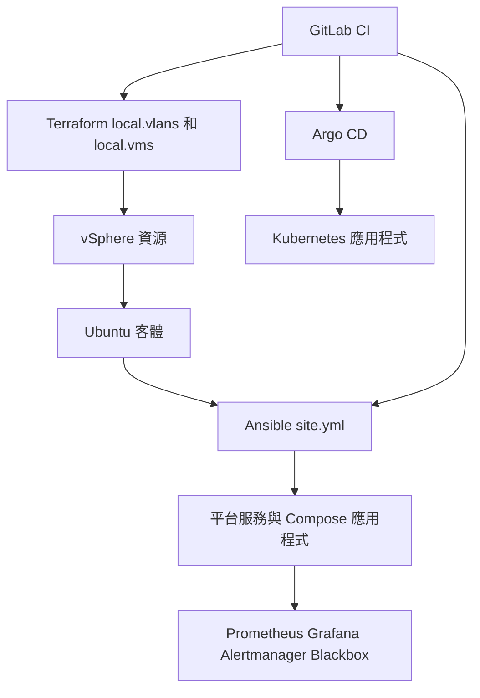

# 平台鏈結與責任邊界

此儲存庫描述一個分層的內部部署平台。以生產環境為導向的路徑從操作員工作站開始，使用面向 vSphere 的 Terraform 建立虛擬基礎架構，再使用 Ansible 設定 Ubuntu 客體及其服務。Kubernetes 和 Go API 內容主要實作為獨立的學習實驗室；請勿推斷其為生產叢集的實作。

| 連結 | 擁有者與責任 | 主要來源 | 邊界／交接 |
|---|---|---|---|
| MacBook | 操作員控制工作站與 CLI 執行點 | `labs/mac-vmware-k8s-gitops/Makefile` | `doctor` 會檢查實驗室所需的 `terraform`、`ansible-playbook`、`kubectl`、`helm` 和 `ssh`。 |
| VMware / vSphere | 虛擬機器、連接埠群組、磁碟與反親和性 | `terraform/environments/prod/main.tf` | Terraform 使用 vSphere 提供者。僅有 VMware Fusion 無法滿足實驗室 Terraform 提供者的邊界。 |
| Ubuntu | 客體基準、磁碟、執行環境、PKI 與服務設定 | `ansible/playbooks/site.yml` | 僅在所需 VM 與連線均已存在後，Ansible 才會開始執行。 |
| Terraform | 生產 IaC 組裝 | `terraform/environments/prod/main.tf` | `local.vlans` 和 `local.vms` 表達平台拓撲。主機清單具有權威性，因此應一併更新它與 Terraform。 |
| Ansible | 依序進行的主機設定與 VM + Compose 應用程式 | `ansible/playbooks/site.yml`、`ansible/playbooks/50-apps.yml` | `site.yml` 編碼相依性順序；`50-apps.yml` 會序列部署已宣告的專案。 |
| containerd / Kubernetes | 僅限實驗室執行環境與叢集 | `labs/mac-vmware-k8s-gitops/ansible/playbooks/site.yml` | 實驗室會在 Kubernetes 套件及控制平面／工作節點階段之前安裝 containerd。 |
| Go API | 學習實驗室應用程式工作負載 | `labs/mac-vmware-k8s-gitops/apps/go-api/main.go` | 它由 `main_test.go` 驗證，並透過實驗室的 GitOps 設定部署。 |
| GitOps | GitLab CI 管控變更；Argo CD 協調 Kubernetes 資訊清單 | `.gitlab-ci.yml`、`argocd/bootstrap/root-app.yaml` | CI 建置或更新宣告；Argo CD 執行以拉取為基礎的 K8s 同步。 |
| 監控 | 所有節點上的節點指標；監控主機上的監控堆疊 | `ansible/playbooks/60-monitoring.yml` | 監控會在服務部署後進行，並透過 Ansible 驗證工作流程檢查。 |

此圖顯示生產環境的控制與交付邊界；Argo CD 分支管理 Kubernetes 應用程式，而非由 Ansible 管理的 Compose 應用程式路徑。

## 生產基礎架構契約

`terraform/environments/prod/main.tf` 指出 Ansible 生產 inventory 是主機清單的真實來源。因此，VM/IP 變更應從 `ansible/inventories/prod/hosts.yml` 開始，在同一份審查中變更相對應的 Terraform locals，並以產生的 `rendered_ansible_inventory` 輸出作為輔助檢查，而非替代來源。`terraform/environments/prod/outputs.tf` 明確保留此方向，以防止 state 成為 inventory 的權威來源。

有狀態磁碟刻意與 OS 磁碟分離，且對於多項服務而言，也彼此分離。Terraform 設定明確指出 PostgreSQL、RabbitMQ、ScyllaDB、NFS、SeaweedFS 及監控儲存空間各自具有獨立的持久性磁碟。請將磁碟生命週期變更視為需要經過審查計畫的基礎架構變更，而非一般的 Ansible 重新執行。

## 兩條工作負載交付路徑

平台具有兩條刻意分離的路徑，並在[GitOps 與監控](../workflows/gitops-and-monitoring.md)中從營運角度加以說明：

- **VM + Docker Compose：** `ansible/playbooks/50-apps.yml` 以 `compose_apps` 為目標，只部署已宣告的專案，並使用 `serial: 1`。負載平衡器健康狀態檢查可在應用程式推出期間一次移除並還原一台主機。
- **Kubernetes + Argo CD：** `argocd/` 樹狀結構宣告 `web-frontend` 和 `web-backend` 應用程式。啟動來源明確排除 `email_proxy`，其 VM + Compose 生命週期仍由 Ansible 擁有。

## 變更指引

### VM、VLAN 或 inventory 變更

1. 從 `ansible/inventories/prod/hosts.yml` 及其相關群組變數開始，接著在 `terraform/environments/prod/main.tf` 進行相對應的變更。
2. 保留從 inventory 到 Terraform 的方向，並檢查變更的節點是否影響角色群組或反親和性。
3. 執行 `make tf-validate` 以進行格式化與離線 Terraform 驗證。生產變更會通過[部署、驗證與復原](../workflows/deployment-and-recovery.md)所述的 CI plan/apply 閘門；請勿以本機驗證取代經審查的計畫。

### 平台元件導入

儲存庫所述的模式包含一個 inventory 群組、群組變數、一個 `site.yml` 階段、一項 `99-verify.yml` 檢查、監控目標、實驗室表示，以及適用時的 Terraform VM。這是跨邊界變更：先驗證語法，然後僅在可於實驗室中測試該元件相依性時使用實驗室。`docs/PLATFORM-GAPS.md` 中的路線圖是意圖證據，而非實作契約。

## 本頁未涵蓋的內容

本頁不記錄密鑰設定、執行階段狀態、憑證內容或 kubeconfig 資料。它也不主張存在生產 Kubernetes 叢集：儲存庫將其標示為平台缺口，而學習實驗室則提供一條不同的實作路徑。