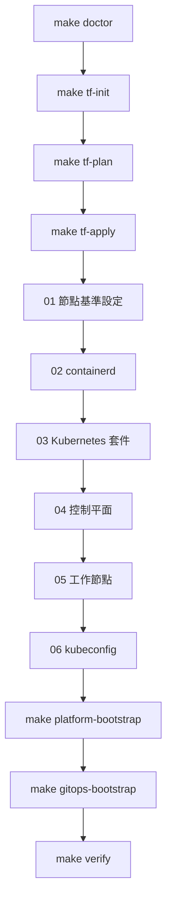

# 從 MacBook 到 Kubernetes 的 GitOps 學習實驗室

`labs/mac-vmware-k8s-gitops/` 是此儲存庫的實作導向學習路徑。它刻意獨立於面向生產環境的 21 節點平台拓撲。它讓後端工程師能夠從工作站工具開始，經由虛擬機器、Ubuntu 設定、containerd、Kubernetes、Go API、Argo CD 與監控，追蹤一項實作流程，而不宣稱生產環境中存在相同的 Kubernetes 叢集。

## 前置條件與範圍

請從實驗室目錄執行命令，或使用 `make -C labs/mac-vmware-k8s-gitops …`。`make doctor` 會檢查 Mac 控制工作站是否具有 `terraform`、`ansible-playbook`、`kubectl`、`helm` 與 `ssh`。

vSphere provider 可以連線至 vCenter/ESXi，但不能連線至 VMware Fusion。若僅有 Fusion，請手動建立三部 Ubuntu VM，並從 Ansible 階段開始；完整的 Terraform 佈建需要可連線的 vSphere 實驗室。實驗室產生的 kubeconfig 是成品邊界；僅能透過提供的命令使用其路徑，且不得提交或記錄其內容。

## 部署順序



此順序結合實驗室 Makefile 與 `ansible/playbooks/site.yml`：Ansible 會依序設定 containerd、Kubernetes 套件、控制平面、工作節點與 kubeconfig 產生；平台初始化接著會安裝 Gateway API、Cilium、MetalLB 與 Argo CD，然後植入根應用程式。

## 命令與驗收檢查

| 階段 | 命令 | 證明事項 | 失敗處理重點 |
|---|---|---|---|
| 本機工具 | `make doctor` | 必要的 Mac 端 CLI 可透過 `PATH` 解析。 | 安裝或選取缺少的 CLI；請勿在工具不完整時繼續。 |
| Terraform 初始化 | `make tf-init` | 在 `terraform/` 中完成 provider 初始化。 | Provider 連線能力／設定屬於 vSphere 實驗室邊界。 |
| 基礎設施預覽 | `make tf-plan` | 可檢閱預期的三 VM 變更。 | 套用前請檢查 Terraform 輸入與 provider 可連線性。 |
| VM 建立 | `make tf-apply` | Terraform 套用 VM 變更並產生 Ansible inventory。 | 修正宣告式輸入後重新執行 plan；請勿手動編輯產生的輸出。 |
| 主機與叢集設定 | `make ansible-check`，然後 `make ansible-apply` | 先執行語法／試跑，再進行 Ubuntu、containerd 與 kubeadm 叢集階段。 | 從與失敗生命週期階段相符的編號 playbook 開始處理。 |
| 叢集健康狀態 | `make kube-status` | 可存取節點與系統 Pod 清單。 | 在排查應用程式 manifest 前，先檢查先前的 Ansible 階段。 |
| 平台附加元件 | `make platform-bootstrap` | Gateway API、Cilium、MetalLB 與 Argo CD 的 Helm 安裝在等待／逾時設定內完成。 | 檢閱特定 Helm／元件步驟；除非環境提供存取，否則此命令會拉取外部 chart。 |
| GitOps 植入 | `make gitops-bootstrap` | 已套用根 Argo CD Application。 | 檢查 `gitops/bootstrap/` 下的根應用程式宣告。 |
| 端對端 | `make verify` | 節點就緒狀態，以及 Argo CD、Go API 與 PostgreSQL 資源存在。 | 讀取 Makefile 中確切的 `kubectl` 查詢，以定位失敗的子系統。 |

`make destroy` 刻意只執行 `terraform plan -destroy`；實際刪除仍需要手動確認。這是一項規劃／安全操作，而不是自動清理。

## Go API 變更導覽

應用程式原始碼位於 `labs/mac-vmware-k8s-gitops/apps/go-api/main.go`，專注測試為 `main_test.go`。`TestHealth` 會檢查 `GET /healthz` 是否傳回 `204`；`TestRootResponse` 會檢查根回應是否識別 `POD_NAME`。GitOps 交接點為 `labs/mac-vmware-k8s-gitops/gitops/apps/50-go-api.yaml`，其指向 `k8s/apps/go-api/overlays/lab`，並使用自動 prune/self-heal。若要變更 HTTP 行為，請先從這些檔案開始，接著透過實驗室目錄追蹤映像檔／建置與 Kubernetes 宣告。精簡的內部檢查為：

```bash
cd labs/mac-vmware-k8s-gitops/apps/go-api && go test ./...
```

若 Go API 變更同時修改 Kubernetes 資源，則在 GitOps 路徑完成協調後，除了此單元層級檢查外，還需要執行實驗室的 `make verify` 面向使用者檢查。這可將內部正確性與已部署資源集合存在的驗證區分開來。

## 快速可拋棄式整合路徑

實驗室 Makefile 也會委派給 `container-lab/` 執行 Docker/kind 整合：`container-up`、`container-platform`、`container-gitops`、`container-verify` 與 `container-down`。若要測試實驗室的 Kubernetes/GitOps 整合而不建立 vSphere VM，請使用此路徑。此路徑會驗證 Cilium、Argo CD 協調、Go API probes、CloudNativePG、Prometheus/Grafana 與 Gateway API，但不會驗證 vSphere 佈建、SSH 初始化、主機 containerd 設定、Longhorn 裝置或實體 LAN 的 MetalLB 行為。`container-down` 會移除 kind 叢集、registry、Git daemon 與測試成品；它是可拋棄式測試的清理作業，而不是資料復原。

面向生產環境的控制平面與監控模型仍記錄於[平台鏈與邊界](../architecture/platform-chain.md)及[GitOps 與監控](../workflows/gitops-and-monitoring.md)；此實驗室與這些頁面共用概念，但不共用其生產拓撲。