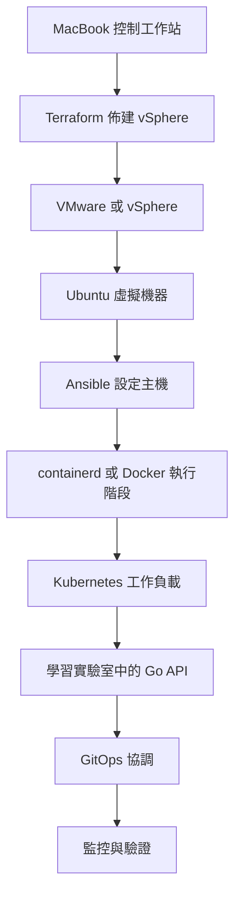

# 地端平台學習入口

本 Wiki 是此儲存庫地端平台的精簡、以證據為基礎的指南。它將面向正式環境的 VMware/Ansible 平台，與 `labs/mac-vmware-k8s-gitops/` 這個三節點學習路徑區分開來。它不會揭露或說明機密值、狀態、私密金鑰、憑證或 kubeconfig 內容。

## 從這裡開始

1. 閱讀 [平台鏈結與邊界](architecture/platform-chain.md)，了解從 MacBook 到監控的每個環節由誰負責。
2. 在變更 Terraform、Ansible 或以 Compose 管理的平台服務之前，請先使用 [部署、驗證與復原](workflows/deployment-and-recovery.md)。
3. 在變更 Kubernetes YAML、Argo CD、交付範本或可觀測性之前，請閱讀 [GitOps 與監控](workflows/gitops-and-monitoring.md)。
4. 依照 [MacBook 到 Kubernetes 學習實驗室](labs/mac-vmware-k8s-learning-lab.md) 進行獨立的實作學習路徑，其中包括 containerd 與 Go API。

此圖表是責任對應圖，並非聲稱每個正式環境工作負載都在 Kubernetes 上執行：正式環境平台也會透過 Ansible 部署 VM + Compose 應用程式。

## 工作導引

| 變更領域或使用者意圖 | 相關 Wiki 頁面 | 確切的原始碼進入點 | 重要符號或型別 | 針對性測試 | 最小驗證命令 |
|---|---|---|---|---|---|
| 檢閱或調整正式環境 VM、VLAN、磁碟或清單的一致性 | [平台鏈結與邊界](architecture/platform-chain.md) | `terraform/environments/prod/main.tf`, `terraform/environments/prod/outputs.tf` | `local.vlans`, `local.vms`, `rendered_ansible_inventory` | 找不到針對性的測試檔案；CI 會驗證 Terraform | `make tf-validate` |
| 變更主機佈建順序或平台服務 | [部署、驗證與復原](workflows/deployment-and-recovery.md) | `ansible/playbooks/site.yml`, `ansible/playbooks/00-bootstrap.yml` 至 `99-verify.yml` | `site.yml`, `compose_app`, `serial: 1` | `ansible/playbooks/99-verify.yml` 中的 `verify-pg` 等標籤 | `make syntax` |
| 操作類正式環境的 Docker 實驗室 | [部署、驗證與復原](workflows/deployment-and-recovery.md) | `ansible/lab/`, `ansible/playbooks/99-verify.yml` | `lab-up`, `lab-deploy`, `lab-verify` | `99-verify.yml` | 部署後執行 `make lab-verify` |
| 變更 Kustomize、Argo CD 應用程式或啟動設定 | [GitOps 與監控](workflows/gitops-and-monitoring.md) | `argocd/bootstrap/root-app.yaml`, `argocd/apps/`, `argocd/k8s/` | 根 `Application`, `syncPolicy.automated` | 找不到儲存庫測試檔案；資訊清單會進行結構描述檢查 | `make argocd-validate` |
| 變更 CI 交付控制項或共用應用程式範本 | [GitOps 與監控](workflows/gitops-and-monitoring.md) | `.gitlab-ci.yml`, `gitlab/ci-templates/` | `terraform-plan`, `terraform-apply`, `ansible-deploy-check` | Pipeline 工作是驗證介面 | `make lint` |
| 建置獨立的 MacBook 到 Kubernetes 學習路徑 | [MacBook 到 Kubernetes 學習實驗室](labs/mac-vmware-k8s-learning-lab.md) | `labs/mac-vmware-k8s-gitops/Makefile`, `labs/mac-vmware-k8s-gitops/ansible/playbooks/site.yml` | `tf-apply`, `ansible-apply`, `platform-bootstrap` | `apps/go-api/main_test.go` | `make -C labs/mac-vmware-k8s-gitops doctor` |
| 變更實驗室 Go HTTP API | [MacBook 到 Kubernetes 學習實驗室](labs/mac-vmware-k8s-learning-lab.md) | `labs/mac-vmware-k8s-gitops/apps/go-api/main.go` | `main.go` 中的 Go API 處理常式 | `apps/go-api/main_test.go` | `cd labs/mac-vmware-k8s-gitops/apps/go-api && go test ./...` |

## 範圍與安全性

- 正式環境基礎架構採宣告式管理：Terraform 負責面向 vSphere 的資源；Ansible 負責來賓系統設定；GitLab CI 提供計畫／審查／手動套用閘門；Argo CD 負責 Kubernetes GitOps 協調邊界。
- `email_proxy` 是由 Ansible 管理的 VM + Docker Compose 工作負載，而非 Argo CD 應用程式。在 `argocd/` 下記錄的 Kubernetes 應用程式是另一條交付路徑。
- 避免直接編輯機器：這會造成與宣告式來源之間的漂移。請先驗證受影響範圍最小的層級；僅在跨服務變更需要端對端證據時，才執行完整實驗室檢查。
- 本 Wiki 不會將儲存庫的路線圖視為已實作的行為。`docs/PLATFORM-GAPS.md` 中提到的 K8s 實作缺口，仍是正式環境平台的規劃項目。

## 待辦事項

- `docs/PLATFORM-GAPS.md`：正式環境 Kubernetes 實作被記錄為 P1 缺口，而 `argocd/` 提供藍圖，學習實驗室則佈建獨立叢集；此儲存庫尚未提供真正正式環境叢集實作的證據。