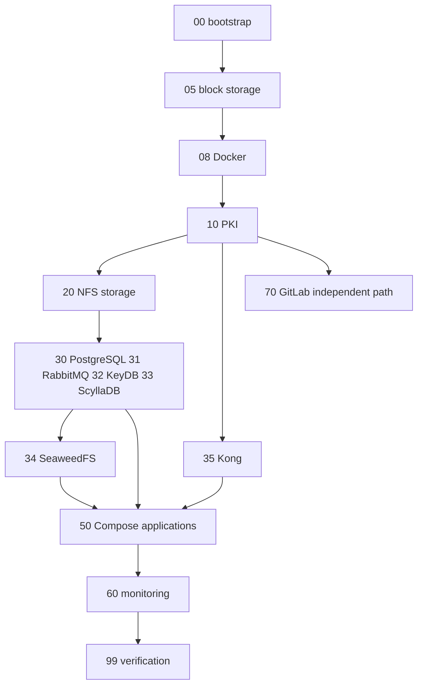

# 平台部署、驗證與復原

變更正式環境的 Terraform/Ansible 路徑或其 Docker 實驗室之前，請先使用本頁。[平台鏈結與界線](../architecture/platform-chain.md)定義了所有權界線；本頁則說明維運順序及最小範圍、具備佐證的檢查項目。

## 相依順序

`ansible/playbooks/site.yml` 是標準順序。其序列是相依性契約，而非視覺分組：

此圖反映 `site.yml`：SeaweedFS 位於 PostgreSQL 之後，因為其 filer store 使用 PostgreSQL；Kong 需要 Docker 與 PKI，但不排在資料服務之後；GitLab 是需要早期基準環境／PKI 路徑的獨立階段。

`compose_apps` 部署還有一項額外不變條件：`ansible/playbooks/50-apps.yml` 使用 `serial: 1`，因此輪替更新一次只會變更一個目標。除非另外證明負載平衡器與可用性行為，否則請勿移除該設定。

## 驗證階梯

| 階段 | 用途 | 命令 | 使用時機 |
|---|---|---|---|
| 靜態 Ansible | 針對正式環境與實驗室 inventory 的 Playbook 語法檢查 | `make syntax` | 變更 Playbook/inventory 後的第一項檢查。 |
| Lint | YAML 與 Ansible lint 檢查 | `make lint` | YAML、角色、Playbook 或 CI 範本路徑變更時。 |
| 靜態 Terraform | 離線初始化、格式檢查與驗證 | `make tf-validate` | Terraform 模組或正式環境設定變更時。 |
| 靜態 Argo CD | 嚴格的 Manifest 結構描述檢查 | `make argocd-validate` | `argocd/` 變更時；請參閱 [GitOps 與監控](gitops-and-monitoring.md)。 |
| 完整實驗室部署 | 建置／啟動實驗室並套用所有 Playbook | `make lab-up && make lab-deploy` | 條件式使用：跨服務 Ansible 變更需要端對端佐證時使用。 |
| 完整實驗室健康狀態 | 實驗室部署後的使用者行為檢查 | `make lab-verify` | 條件式使用：在 `lab-deploy` 之後，或診斷實驗室失敗時。 |
| CI 計畫 | 檢閱預定的正式環境變更 | GitLab `terraform-plan` 或 `ansible-deploy-check` 工作 | 手動套用至正式環境前必須執行；本機檢查無法取代此項目。 |

`99-verify.yml` 是用於平台行為的聚焦測試套件。其設計為唯讀或可自行清理，並提供用於精準診斷的標籤，例如 `verify-etcd`、`verify-pg`、`verify-pgbouncer` 與 `verify-mq`。請優先使用與變更服務對應的標籤，而非重新執行不相關的檢查。

## 部署與核准界線

`.gitlab-ci.yml` 使用 `lint → validate → plan → apply`。Lint/validate 執行時不會產生預定的正式環境變更；plan 工作會產生供檢閱的佐證。Terraform apply 在 `main` 上手動執行，透過 `resource_group: terraform-prod` 序列化，並套用已儲存的 `tfplan`，而不是在 apply 時重新計算。這是已交付的維運界線：在 CI plan 經過檢閱前，即使本機驗證通過的 Terraform 變更也尚未具備正式環境就緒狀態。

Ansible 的正式環境檢查工作使用 `ansible-playbook playbooks/site.yml --check --diff`。CI 設定警告，當資源或 handler 相依項目尚未存在時，首次部署可能會產生 check-mode 偽陽性。請將其視為既有系統變更的高價值檢閱佐證，而非首次安裝可順利執行的證明。

## 依失敗點分類處理

| 症狀 | 首先檢查的來源 | 精準的後續動作 | 必須維持的界線 |
|---|---|---|---|
| Terraform 驗證或計畫與預期拓撲不同 | `terraform/environments/prod/main.tf`、對應 inventory | `make tf-validate`，然後檢閱 CI plan artifact | Inventory 仍為權威來源；請勿從 Terraform state 產生它。 |
| Ansible 無法剖析或鎖定錯誤的群組 | `ansible/playbooks/site.yml`、inventory 與群組變數 | `make syntax` | 群組成員資格決定是否執行選用階段。 |
| 資料服務未符合健康狀態條件 | `ansible/playbooks/99-verify.yml` | 在已部署環境中執行相關的 `verify-*` 標籤 | 診斷行為（leader/quorum/routing），而不只是處理程序是否存在。 |
| Compose rollout 影響可用性 | `ansible/playbooks/50-apps.yml` 與 LB 角色／設定 | 確認宣告的專案相依性並保留 `serial: 1` | VM + Compose 由 Ansible 管理，並非 Argo CD 工作負載。 |
| 大範圍變更後實驗室不健康 | `ansible/lab/`、`99-verify.yml` | `make lab-verify`；僅將 `make lab-sh` 用於受控的實驗室調查 | 請勿將實驗室容器狀態推論為正式環境狀態。 |

## 回復與破壞性動作

在檢查過的正式環境原始碼中，沒有單一通用的回復命令。回復必須遵循已變更的宣告式層級：

- **Terraform：** 手動 apply 前先檢閱 CI plan。還原已檢閱的原始碼變更並取得新的 plan；請勿嘗試重建或編輯 state。多個定義刻意將持久資料磁碟排除於 VM snapshot 之外，因此重新建立 VM 並不是安全的資料回復機制。
- **Ansible 設定或 Compose 應用程式：** 還原目標設定或映像宣告，然後透過相同的受控管線部署。對於應用程式 rollout 行為，請保留 `serial: 1` 機制。
- **Docker 實驗室：** `make lab-destroy` 會執行 `docker compose down -v --remove-orphans`；它會刪除實驗室磁碟區，因此是重設而非復原程序。僅在可接受捨棄實驗室資料時使用。

Kubernetes/Argo CD 回復是 Git revision 與 reconciliation 的議題，相關說明請參閱 [GitOps 與監控](gitops-and-monitoring.md)。