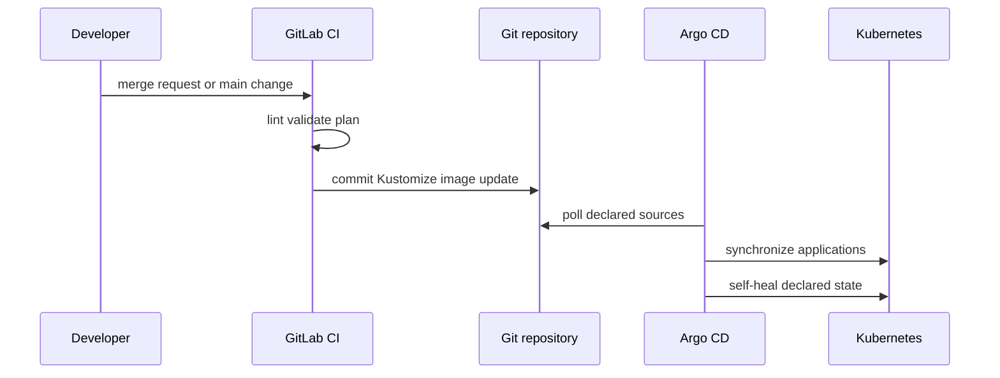
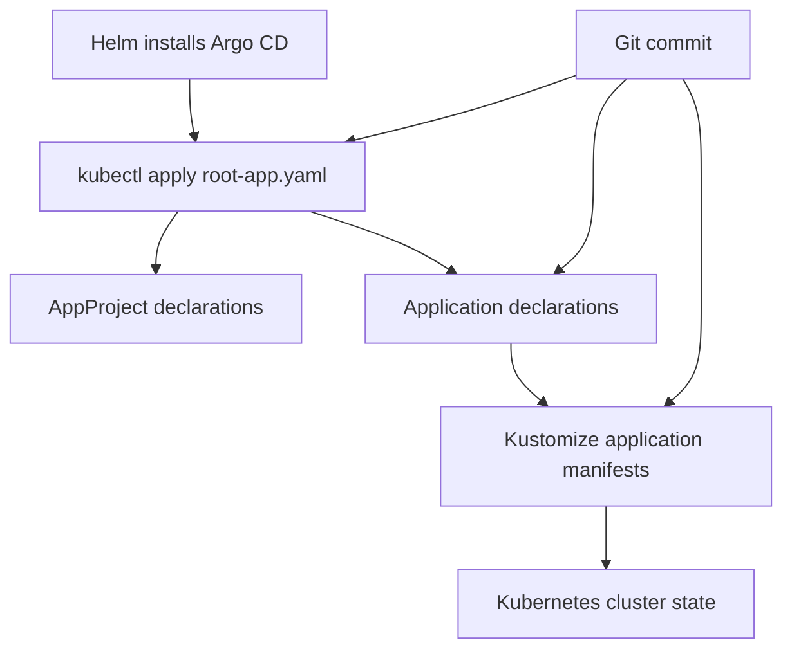

# GitOps 交付與監控邊界

此儲存庫使用 GitLab CI 作為審查與交付控制平面，並使用 Argo CD 作為 Kubernetes 拉取式協調平面。正式環境監控角色是在監控主機上由 Ansible 管理的服務。這些是彼此相關的控制迴路，但並不表示每個平台工作負載都是 Kubernetes 工作負載。

## 交付流程

此順序圖說明由 `.gitlab-ci.yml`、`gitlab/README.md` 與 `argocd/bootstrap/root-app.yaml` 文件化的 Kubernetes 路徑：CI 會更新 Git 宣告，而非直接套用應用程式工作負載；Argo CD 則從 Git 進行同步與自我修復。

## CI 閘門與公開交付介面

基礎架構管線有四個固定階段：`lint`、`validate`、`plan` 與 `apply`。它使用 `rules:changes` 讓 Terraform、Ansible 與 Argo CD 變更保持在其範圍內。Terraform 的計畫是供審查使用的成品；在 `main` 上的手動套用會使用已儲存的計畫，並以序列化方式執行。如需詳細的基礎架構排序與復原限制，請以[平台部署、驗證與復原](deployment-and-recovery.md)為準。

`gitlab/ci-templates/` 提供三個面向使用者的應用程式範本：

| 使用者路徑 | 範本用途 | 交付交接 |
|---|---|---|
| Go 後端儲存庫 | `ci-templates/backend.gitlab-ci.yml` | 建置／推送映像、更新 Kustomize 映像標籤，由 Argo CD 同步。 |
| Node 前端儲存庫 | `ci-templates/frontend.gitlab-ci.yml` | 建置／推送映像、更新 Kustomize 映像標籤，由 Argo CD 同步。 |
| VM + Compose 應用程式儲存庫 | `ci-templates/compose-app.gitlab-ci.yml` | 建置／推送映像、觸發基礎架構管線，然後 Ansible `50-apps.yml` 依序更新主機。 |

若新的公開範本或匯出工作流程僅能在內部解析，便是不完整的：請驗證其使用者匯入路徑、目標儲存庫假設、註冊／觸發接線，以及其所叫用的交付邊界。`make lint` 是用於範本／YAML 變更的精簡本機檢查；相應的 GitLab 管線則是面向使用者的檢查。

## Argo CD 生命週期與安全邊界

在 Argo CD 本身安裝完成後，`argocd/bootstrap/root-app.yaml` 是操作人員手動套用的唯一 Application。它監看 `argocd/projects` 與 `argocd/apps`；子應用程式宣告接著會指向 Kustomize 內容。`syncPolicy.automated` 啟用 `prune` 與 `selfHeal`，並設有重試退避。根 Application 刻意不設 finalizer：刪除它時，應移除根物件而不連鎖刪除整個平台工作負載樹；重新套用 `root-app.yaml` 即可恢復管理。

此圖描繪 App-of-Apps 階層，其中在 bootstrap 種子存在後，Argo CD 會觀察 Git 變更。

### 變更做法：新增或變更 Kubernetes 應用程式

1. 從 `argocd/apps/` 下的子 `Application` 及其在 `argocd/k8s/` 下參照的 Kustomize 目錄開始。
2. 確認 `argocd/projects/` 中的 AppProject 範圍允許該來源與目的地；根應用程式只會探索最上層的專案／應用程式宣告。
3. 使用 `make argocd-validate` 驗證所有資訊清單。此命令使用 `kubeconform -strict -ignore-missing-schemas -summary`，因此 Argo CD CRD 缺少 schema，但未知的一般欄位仍會遭到拒絕。
4. 若 CI 範本變更映像更新行為，請檢查範本的實際使用者路徑及其 Kustomize 映像目標。請勿手動修補運行中的叢集來取代 Git 宣告。
5. 如需回復，請還原先前的 Git 宣告／修訂版本，並觀察 Application 狀態。`revisionHistoryLimit: 10` 支援 UI 歷程記錄，但檢視的來源並未定義獨立的腳本化回復命令。

請勿將 `email_proxy` 加入此樹狀結構。`argocd/bootstrap/README.md` 與根應用程式的註解明確將其指定為由 Ansible 管理的 VM + Docker Compose 工作負載。此邊界將 Argo CD 與[平台鏈結與邊界](../architecture/platform-chain.md)相連，但不混淆這兩條交付路徑。

## 監控部署與限制

`ansible/playbooks/60-monitoring.yml` 會將 `node_exporter` 部署至所有主機，接著透過 `monitoring` 角色，在 `monitoring` 群組中的主機上部署 Prometheus、Grafana、Alertmanager 與 Blackbox。來源指出會直接由 Prometheus 擷取 Patroni、RabbitMQ 與 HAProxy 指標端點。

監控會在 `site.yml` 中的應用程式服務之後部署，並透過[平台部署、驗證與復原](deployment-and-recovery.md)所描述的相同端對端框架進行驗證。`docs/PLATFORM-GAPS.md` 指出實際警示傳遞與集中式日誌等營運缺口；請將其視為待辦事項，而非既有監控行為。特別是，除非已新增並驗證相關角色／設定，否則請勿宣稱已設定通知或集中式記錄。

## 正式環境與學習實驗室 Kubernetes

`argocd/` 提供面向正式環境的 bootstrap／資訊清單，但假設已有可用的 Kubernetes 叢集與先決條件。儲存庫的缺口分析指出，正式環境叢集的實作仍是 P1 項目。另行實作的 `labs/mac-vmware-k8s-gitops/` 路徑會安裝實驗室叢集及其平台元件；請使用 [MacBook 至 Kubernetes 學習實驗室](../labs/mac-vmware-k8s-learning-lab.md)瞭解該生命週期及其本機命令。